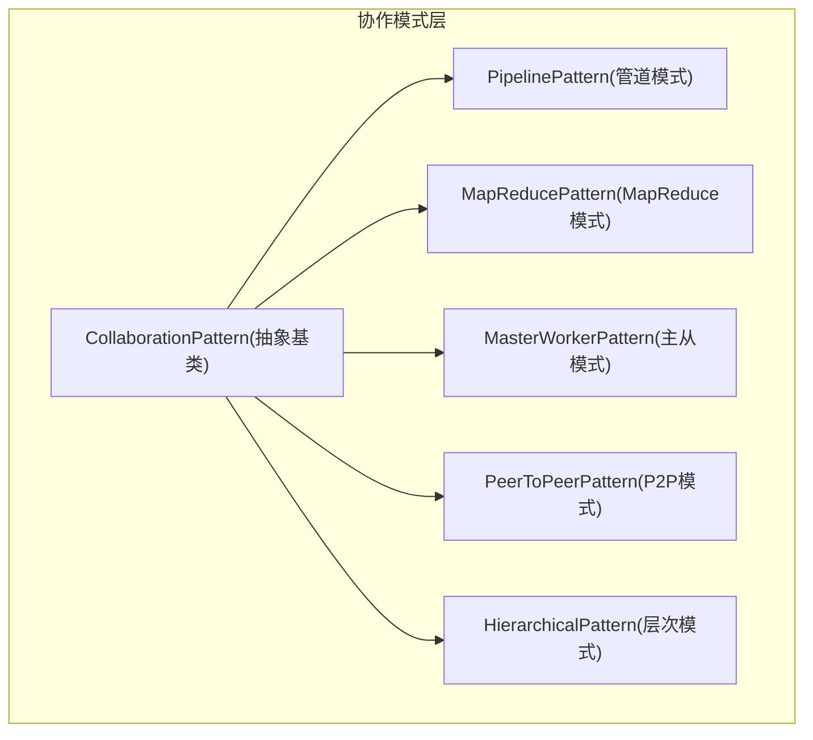
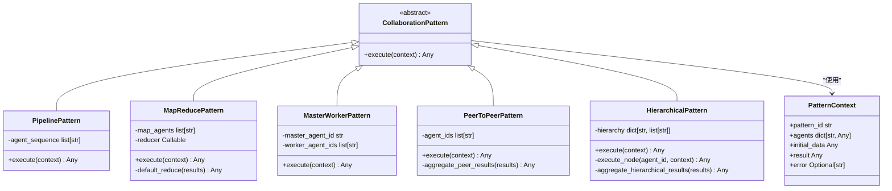
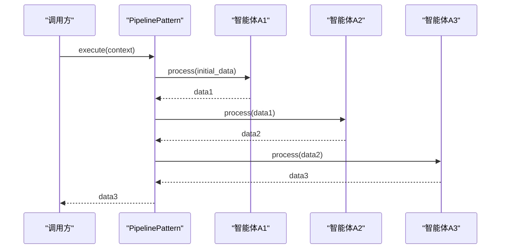
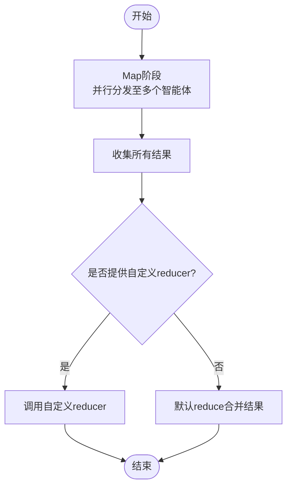
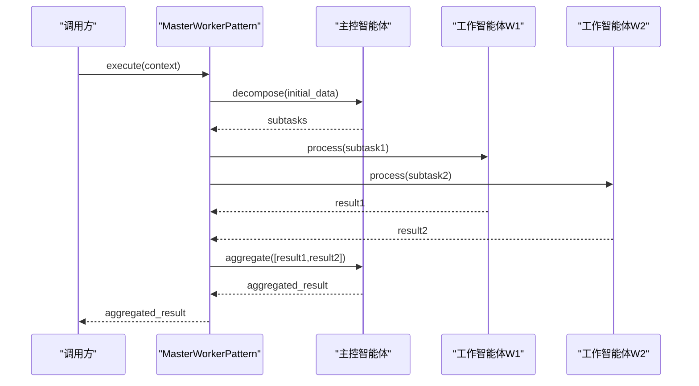
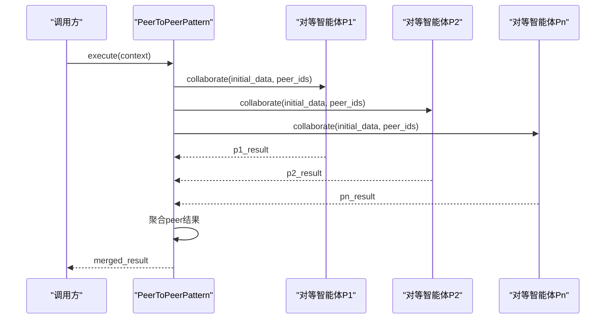
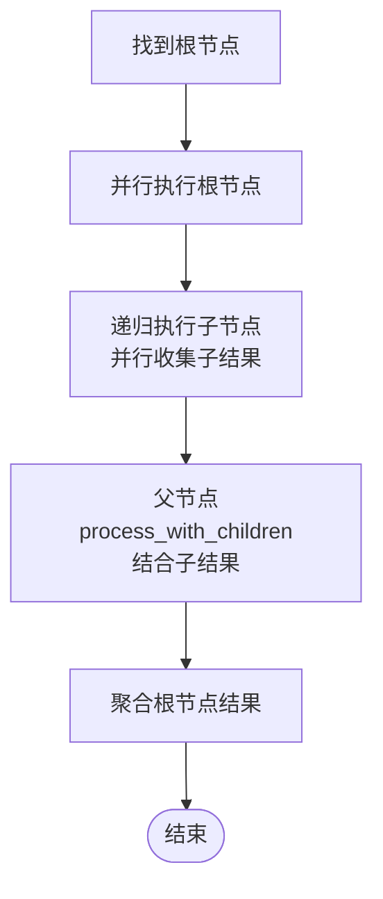
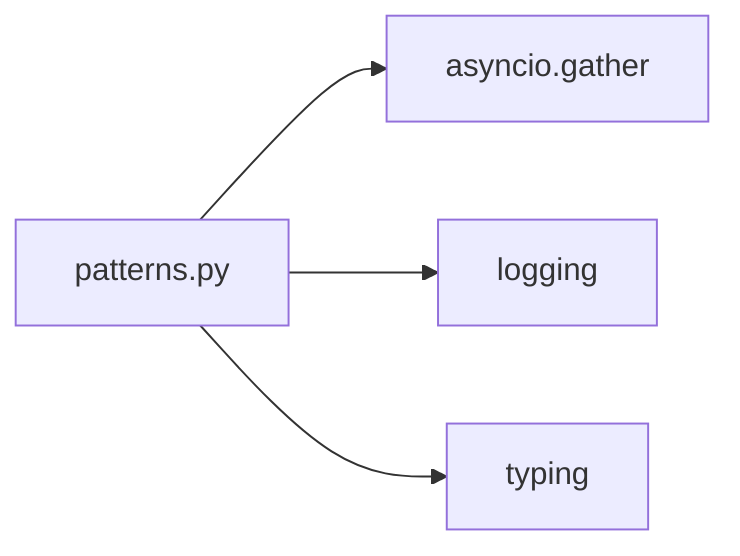

# 多智能体协作

<cite>
**本文引用的文件**   
- [patterns.py](file://archive/dead_code_2026-07-19/backend/app/core/collaboration/patterns.py)
</cite>

## 目录
1. [简介](#简介)
2. [项目结构](#项目结构)
3. [核心组件](#核心组件)
4. [架构总览](#架构总览)
5. [详细组件分析](#详细组件分析)
6. [依赖关系分析](#依赖关系分析)
7. [性能考量](#性能考量)
8. [故障排查指南](#故障排查指南)
9. [结论](#结论)
10. [附录](#附录)

## 简介
本技术文档围绕 X-Agent 的多智能体协作系统，聚焦于四种典型协作模式的实现与使用：管道模式、MapReduce 模式、主从模式与 P2P 模式。文档基于仓库中已实现的协作模式代码进行深度解析，涵盖任务分发策略（负载均衡、能力匹配、优先级调度）、智能体间通信机制（消息传递、事件总线、服务发现）以及容错机制（故障检测、自动恢复、降级策略）。同时提供协作模式选择指南、性能优化建议、具体场景示例与最佳实践，帮助读者快速理解并落地多智能体协作方案。

## 项目结构
当前协作模式的核心实现位于归档目录下的 patterns 模块，采用“模式即类”的设计，通过统一的抽象基类定义执行接口，各模式子类分别实现不同的编排逻辑。该设计便于扩展新的协作模式并保持调用方一致。

图示来源
- [patterns.py:25-38](file://archive/dead_code_2026-07-19/backend/app/core/collaboration/patterns.py#L25-L38)
- [patterns.py:41-75](file://archive/dead_code_2026-07-19/backend/app/core/collaboration/patterns.py#L41-L75)
- [patterns.py:78-141](file://archive/dead_code_2026-07-19/backend/app/core/collaboration/patterns.py#L78-L141)
- [patterns.py:144-208](file://archive/dead_code_2026-07-19/backend/app/core/collaboration/patterns.py#L144-L208)
- [patterns.py:211-260](file://archive/dead_code_2026-07-19/backend/app/core/collaboration/patterns.py#L211-L260)
- [patterns.py:263-327](file://archive/dead_code_2026-07-19/backend/app/core/collaboration/patterns.py#L263-L327)

章节来源
- [patterns.py:1-328](file://archive/dead_code_2026-07-19/backend/app/core/collaboration/patterns.py#L1-L328)

## 核心组件
- 统一上下文对象 PatternContext：承载模式 ID、智能体集合、初始数据、结果与错误信息，贯穿所有模式的执行生命周期。
- 抽象基类 CollaborationPattern：定义 execute(context) 接口，约束所有协作模式的执行入口。
- 具体模式实现：
  - PipelinePattern：顺序串联多个智能体处理阶段。
  - MapReducePattern：并行映射到多个智能体，再归约聚合结果。
  - MasterWorkerPattern：由主控智能体分解任务并分发给工作智能体，最后汇总。
  - PeerToPeerPattern：对等智能体之间并行协作，最终合并结果。
  - HierarchicalPattern：树形层级协作，自顶向下递归执行子节点后汇聚。

章节来源
- [patterns.py:14-23](file://archive/dead_code_2026-07-19/backend/app/core/collaboration/patterns.py#L14-L23)
- [patterns.py:25-38](file://archive/dead_code_2026-07-19/backend/app/core/collaboration/patterns.py#L25-L38)
- [patterns.py:41-75](file://archive/dead_code_2026-07-19/backend/app/core/collaboration/patterns.py#L41-L75)
- [patterns.py:78-141](file://archive/dead_code_2026-07-19/backend/app/core/collaboration/patterns.py#L78-L141)
- [patterns.py:144-208](file://archive/dead_code_2026-07-19/backend/app/core/collaboration/patterns.py#L144-L208)
- [patterns.py:211-260](file://archive/dead_code_2026-07-19/backend/app/core/collaboration/patterns.py#L211-L260)
- [patterns.py:263-327](file://archive/dead_code_2026-07-19/backend/app/core/collaboration/patterns.py#L263-L327)

## 架构总览
下图展示了协作模式层的类关系与职责划分，体现“统一抽象 + 多实现”的扩展性设计。

图示来源
- [patterns.py:14-23](file://archive/dead_code_2026-07-19/backend/app/core/collaboration/patterns.py#L14-L23)
- [patterns.py:25-38](file://archive/dead_code_2026-07-19/backend/app/core/collaboration/patterns.py#L25-L38)
- [patterns.py:41-75](file://archive/dead_code_2026-07-19/backend/app/core/collaboration/patterns.py#L41-L75)
- [patterns.py:78-141](file://archive/dead_code_2026-07-19/backend/app/core/collaboration/patterns.py#L78-L141)
- [patterns.py:144-208](file://archive/dead_code_2026-07-19/backend/app/core/collaboration/patterns.py#L144-L208)
- [patterns.py:211-260](file://archive/dead_code_2026-07-19/backend/app/core/collaboration/patterns.py#L211-L260)
- [patterns.py:263-327](file://archive/dead_code_2026-07-19/backend/app/core/collaboration/patterns.py#L263-L327)

## 详细组件分析

### 管道模式（PipelinePattern）
- 执行流程：按 agent_sequence 顺序依次调用每个智能体的 process 方法，将上一阶段的输出作为下一阶段的输入。
- 关键特性：
  - 顺序依赖强，适合有明确前后处理的流水线。
  - 异常在任一阶段抛出时，会记录错误并中断后续执行。
- 适用场景：文本清洗→特征提取→模型推理→结果格式化。

图示来源
- [patterns.py:41-75](file://archive/dead_code_2026-07-19/backend/app/core/collaboration/patterns.py#L41-L75)

章节来源
- [patterns.py:41-75](file://archive/dead_code_2026-07-19/backend/app/core/collaboration/patterns.py#L41-L75)

### MapReduce 模式（MapReducePattern）
- 执行流程：
  - Map 阶段：将 initial_data 并行分发给 map_agents 列表中的智能体，调用其 process 方法。
  - Reduce 阶段：若提供自定义 reducer，则调用之；否则使用默认 reduce 合并结果为字典或带索引键的结果集。
- 关键特性：
  - 高度并行，适合独立可分割的任务。
  - 支持自定义归约函数以适配不同聚合需求。
- 适用场景：批量数据处理、分布式检索、并行评测。

图示来源
- [patterns.py:78-141](file://archive/dead_code_2026-07-19/backend/app/core/collaboration/patterns.py#L78-L141)

章节来源
- [patterns.py:78-141](file://archive/dead_code_2026-07-19/backend/app/core/collaboration/patterns.py#L78-L141)

### 主从模式（MasterWorkerPattern）
- 执行流程：
  - 主控智能体 decompose(initial_data) 生成子任务列表。
  - 将子任务分配给 worker_agent_ids 对应的智能体，调用其 process 方法。
  - 主控智能体 aggregate(worker_results) 汇总结果。
- 关键特性：
  - 主控负责任务拆分与结果聚合，具备集中式协调优势。
  - 当 worker 缺失时会跳过并记录警告，但整体仍继续执行。
- 适用场景：批处理作业、分片计算、结果汇总报告。

图示来源
- [patterns.py:144-208](file://archive/dead_code_2026-07-19/backend/app/core/collaboration/patterns.py#L144-L208)

章节来源
- [patterns.py:144-208](file://archive/dead_code_2026-07-19/backend/app/core/collaboration/patterns.py#L144-L208)

### P2P 模式（PeerToPeerPattern）
- 执行流程：
  - 初始化所有 peer 智能体，调用其 collaborate(initial_data, peer_ids)。
  - 并行执行所有 peer 任务，随后聚合结果。
- 关键特性：
  - 对等协作，无中心控制，适合去中心化协同。
  - 聚合阶段将字典结果合并，非字典结果以索引键保存。
- 适用场景：共识达成、分布式投票、多视角融合。

图示来源
- [patterns.py:211-260](file://archive/dead_code_2026-07-19/backend/app/core/collaboration/patterns.py#L211-L260)

章节来源
- [patterns.py:211-260](file://archive/dead_code_2026-07-19/backend/app/core/collaboration/patterns.py#L211-L260)

### 层次模式（HierarchicalPattern）
- 执行流程：
  - 根据 hierarchy 构建父子关系，识别根节点。
  - 自顶向下递归执行子节点，子节点结果作为父节点的输入之一，调用 process_with_children。
  - 最终聚合各根节点结果。
- 关键特性：
  - 树形结构，适合复杂任务的层级分解与汇总。
  - 子节点并行执行，提升整体吞吐。
- 适用场景：组织级任务编排、多级审核、分层数据分析。

图示来源
- [patterns.py:263-327](file://archive/dead_code_2026-07-19/backend/app/core/collaboration/patterns.py#L263-L327)

章节来源
- [patterns.py:263-327](file://archive/dead_code_2026-07-19/backend/app/core/collaboration/patterns.py#L263-L327)

## 依赖关系分析
- 内部依赖：
  - 所有模式均依赖 asyncio.gather 实现并发执行。
  - 模式间无直接耦合，仅共享抽象基类与上下文对象。
- 外部依赖：
  - logging 用于日志记录。
  - typing 提供类型注解。
- 潜在风险：
  - 未显式限制并发度，大规模智能体可能引发资源竞争。
  - 缺少重试与熔断机制，单点失败可能导致整体失败。

图示来源
- [patterns.py:1-11](file://archive/dead_code_2026-07-19/backend/app/core/collaboration/patterns.py#L1-L11)
- [patterns.py:41-75](file://archive/dead_code_2026-07-19/backend/app/core/collaboration/patterns.py#L41-L75)
- [patterns.py:78-141](file://archive/dead_code_2026-07-19/backend/app/core/collaboration/patterns.py#L78-L141)
- [patterns.py:144-208](file://archive/dead_code_2026-07-19/backend/app/core/collaboration/patterns.py#L144-L208)
- [patterns.py:211-260](file://archive/dead_code_2026-07-19/backend/app/core/collaboration/patterns.py#L211-L260)
- [patterns.py:263-327](file://archive/dead_code_2026-07-19/backend/app/core/collaboration/patterns.py#L263-L327)

章节来源
- [patterns.py:1-328](file://archive/dead_code_2026-07-19/backend/app/core/collaboration/patterns.py#L1-L328)

## 性能考量
- 并发控制：
  - 当前实现直接使用 gather 并发，建议在高层增加信号量或线程池限制并发度，避免资源耗尽。
- 任务粒度：
  - MapReduce 模式下，合理切分 initial_data 可降低单个任务开销，提高吞吐。
- 结果聚合：
  - 自定义 reducer 应尽量避免 O(n^2) 操作，优先使用增量聚合或流式合并。
- I/O 与 CPU 混合负载：
  - 对于 I/O 密集型智能体，可考虑异步队列与背压机制；CPU 密集型需限制进程/线程数。
- 监控与度量：
  - 为每个阶段埋点耗时与错误率，便于定位瓶颈与调优。

[本节为通用性能指导，不直接分析具体文件]

## 故障排查指南
- 常见错误与定位：
  - 智能体缺失：模式在执行前检查 agents 字典，缺失会记录警告并跳过。可通过日志确认缺失的 agent_id。
  - 阶段异常：任一阶段抛出异常会被捕获并记录错误，同时设置 context.error。上层应检查 context.error 并做相应处理。
  - 聚合失败：自定义 reducer 或默认聚合逻辑出错会导致 reduce 阶段失败，需检查返回数据结构是否符合预期。
- 调试建议：
  - 开启详细日志，关注“Pipeline error”、“MapReduce error”、“MasterWorker error”、“P2P error”等关键字。
  - 在 execute 入口打印 context.initial_data 与 pattern_id，确保上下文正确传入。
- 恢复策略：
  - 对可重试的错误（如网络抖动），可在上层封装重试逻辑。
  - 对不可恢复的错误，记录完整上下文并触发告警。

章节来源
- [patterns.py:41-75](file://archive/dead_code_2026-07-19/backend/app/core/collaboration/patterns.py#L41-L75)
- [patterns.py:78-141](file://archive/dead_code_2026-07-19/backend/app/core/collaboration/patterns.py#L78-L141)
- [patterns.py:144-208](file://archive/dead_code_2026-07-19/backend/app/core/collaboration/patterns.py#L144-L208)
- [patterns.py:211-260](file://archive/dead_code_2026-07-19/backend/app/core/collaboration/patterns.py#L211-L260)
- [patterns.py:263-327](file://archive/dead_code_2026-07-19/backend/app/core/collaboration/patterns.py#L263-L327)

## 结论
X-Agent 的多智能体协作系统通过统一的抽象基类与多种模式实现，提供了灵活且可扩展的编排能力。管道模式适用于线性处理，MapReduce 模式擅长并行计算，主从模式适合集中式协调，P2P 模式支持去中心化协作，层次模式则可表达复杂的树形任务。在实际工程中，建议结合业务场景选择合适的模式，并在上层补充负载均衡、能力匹配、优先级调度、消息总线与服务发现等基础设施，以提升系统的稳定性与性能。

[本节为总结性内容，不直接分析具体文件]

## 附录

### 协作模式选择指南
- 管道模式：
  - 选择条件：步骤顺序严格、数据单向流动。
  - 优点：简单直观、易于调试。
  - 缺点：串行瓶颈明显。
- MapReduce 模式：
  - 选择条件：任务可独立并行、结果可聚合。
  - 优点：高吞吐、易扩展。
  - 缺点：聚合逻辑复杂度较高。
- 主从模式：
  - 选择条件：需要集中式任务拆分与结果汇总。
  - 优点：控制力强、易于监控。
  - 缺点：主控成为单点。
- P2P 模式：
  - 选择条件：去中心化协作、对等协商。
  - 优点：鲁棒性强、无单点。
  - 缺点：协调复杂度高。
- 层次模式：
  - 选择条件：任务具有天然层级结构。
  - 优点：结构化清晰、可并行子树。
  - 缺点：树构建与维护成本。

[本节为概念性指导，不直接分析具体文件]

### 任务分发策略建议
- 负载均衡：
  - 基于队列与令牌桶限制并发，避免过载。
  - 动态扩缩容：根据队列长度与响应时间调整 worker 数量。
- 能力匹配：
  - 为智能体注册能力标签，路由时按标签匹配。
  - 引入评分机制，选择最合适的智能体。
- 优先级调度：
  - 为任务设置优先级，高优先级先入队。
  - 支持抢占与超时，保障 SLA。

[本节为概念性指导，不直接分析具体文件]

### 智能体间通信机制建议
- 消息传递：
  - 使用异步消息队列（如 Redis/RabbitMQ）解耦生产与消费。
- 事件总线：
  - 发布订阅模型，支持事件驱动编排。
- 服务发现：
  - 注册中心维护智能体实例与健康状态，动态更新可用列表。

[本节为概念性指导，不直接分析具体文件]

### 容错机制建议
- 故障检测：
  - 心跳与健康检查，及时剔除不健康实例。
- 自动恢复：
  - 失败重试、幂等处理、补偿事务。
- 降级策略：
  - 关键路径降级为只读或缓存结果，保障可用性。

[本节为概念性指导，不直接分析具体文件]

### 协作场景示例与最佳实践
- 示例一：数据清洗流水线
  - 使用管道模式，依次执行格式校验、字段映射、脱敏处理。
  - 最佳实践：每步独立测试，提供回滚快照。
- 示例二：批量评测
  - 使用 MapReduce 模式，并行评测多条样本，自定义 reducer 汇总指标。
  - 最佳实践：控制并发度，避免 LLM 限流。
- 示例三：分布式审核
  - 使用主从模式，主控拆分审核项，工作智能体并行审核，主控汇总意见。
  - 最佳实践：设置超时与重试，记录分歧案例。
- 示例四：多源融合
  - 使用 P2P 模式，各智能体贡献局部视图，最终合并为全局决策。
  - 最佳实践：定义一致的输出 schema，便于合并。

[本节为概念性指导，不直接分析具体文件]