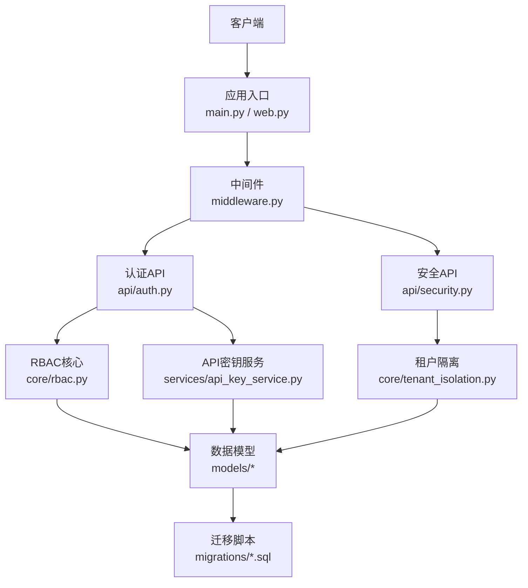
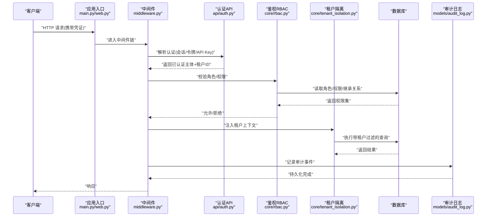
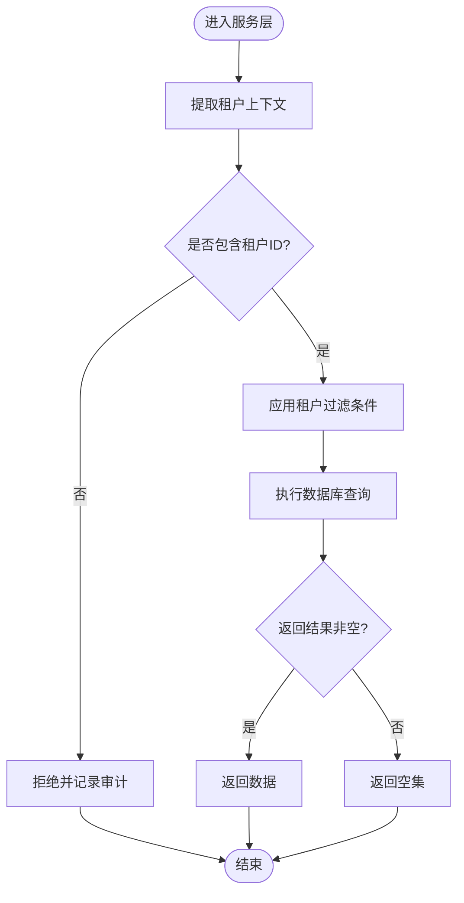
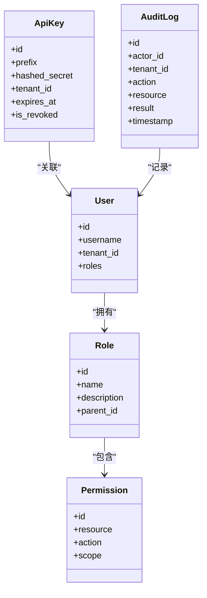
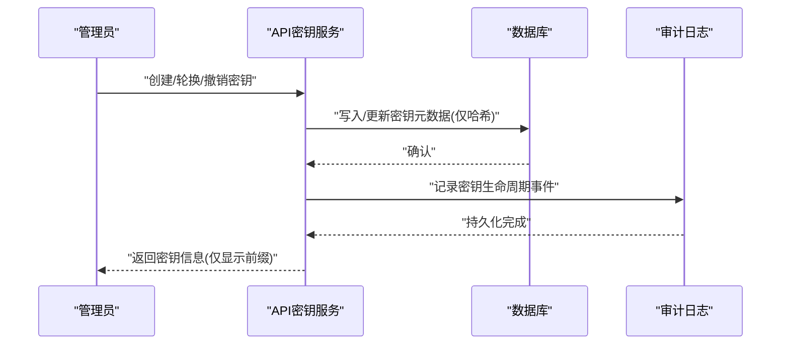
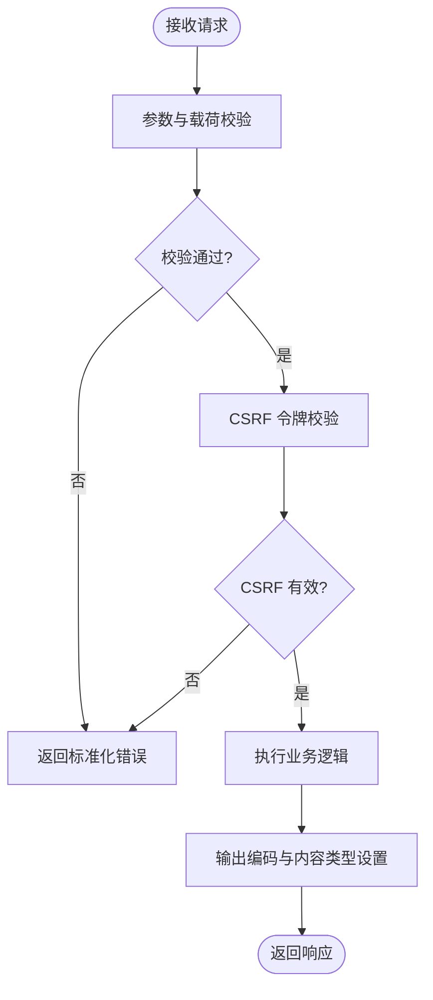
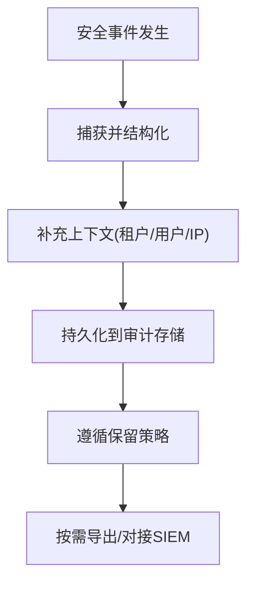
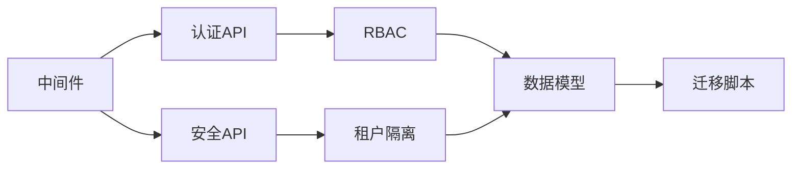

# 安全与认证

<cite>
**本文引用的文件**   
- [backend/app/main.py](file://backend/app/main.py)
- [backend/app/web.py](file://backend/app/web.py)
- [backend/app/middleware.py](file://backend/app/middleware.py)
- [backend/app/settings.py](file://backend/app/settings.py)
- [backend/app/dependencies.py](file://backend/app/dependencies.py)
- [backend/app/api/auth.py](file://backend/app/api/auth.py)
- [backend/app/api/security.py](file://backend/app/api/security.py)
- [backend/app/core/rbac.py](file://backend/app/core/rbac.py)
- [backend/app/core/tenant_isolation.py](file://backend/app/core/tenant_isolation.py)
- [backend/app/services/api_key_service.py](file://backend/app/services/api_key_service.py)
- [backend/app/models/user.py](file://backend/app/models/user.py)
- [backend/app/models/role.py](file://backend/app/models/role.py)
- [backend/app/models/permission.py](file://backend/app/models/permission.py)
- [backend/app/models/api_key.py](file://backend/app/models/api_key.py)
- [backend/app/models/audit_log.py](file://backend/app/models/audit_log.py)
- [backend/app/migrations/init_schema.sql](file://backend/app/migrations/init_schema.sql)
- [backend/app/migrations/admin_user_tenant_schema.sql](file://backend/app/migrations/admin_user_tenant_schema.sql)
- [backend/local/config.py](file://backend/local/config.py)
- [backend/local/encryption.py](file://backend/local/encryption.py)
- [tests/test_security_auth.py](file://tests/test_security_auth.py)
- [tests/test_security_authz.py](file://tests/test_security_authz.py)
- [tests/test_security_api_comprehensive.py](file://tests/test_security_api_comprehensive.py)
- [tests/test_security_rate_limit.py](file://tests/test_security_rate_limit.py)
- [tests/test_security_sandbox.py](file://tests/test_security_sandbox.py)
- [tests/enterprise/test_api_key_manager.py](file://tests/enterprise/test_api_key_manager.py)
- [tests/enterprise/test_audit_enhanced.py](file://tests/enterprise/test_audit_enhanced.py)
- [tests/enterprise/test_oidc_sso_flow.py](file://tests/enterprise/test_oidc_sso_flow.py)
- [tests/enterprise/test_scim_api.py](file://tests/enterprise/test_scim_api.py)
</cite>

## 目录
1. [简介](#简介)
2. [项目结构](#项目结构)
3. [核心组件](#核心组件)
4. [架构总览](#架构总览)
5. [详细组件分析](#详细组件分析)
6. [依赖关系分析](#依赖关系分析)
7. [性能考量](#性能考量)
8. [故障排查指南](#故障排查指南)
9. [结论](#结论)
10. [附录](#附录)

## 简介
本技术文档聚焦 X-Agent 的安全与认证体系，围绕多租户隔离、基于角色的访问控制（RBAC）、API 密钥管理、CSRF 防护、输入验证与输出编码、安全配置与最佳实践，以及安全审计与合规性实现进行系统化说明。文档旨在帮助开发者、运维与安全工程师理解并正确落地企业级安全能力。

## 项目结构
X-Agent 后端采用分层与模块化组织：
- 应用入口与中间件：负责启动、全局中间件装配、请求生命周期钩子
- API 层：路由与控制器，承载认证、鉴权、业务接口
- 核心能力：RBAC、租户隔离、策略引擎等
- 服务层：API 密钥服务、加密服务等
- 数据模型与迁移：用户、角色、权限、API Key、审计日志等实体及数据库初始化脚本
- 测试：覆盖认证、鉴权、速率限制、沙箱、企业特性（OIDC SSO、SCIM）等

图表来源
- [backend/app/main.py](file://backend/app/main.py)
- [backend/app/web.py](file://backend/app/web.py)
- [backend/app/middleware.py](file://backend/app/middleware.py)
- [backend/app/api/auth.py](file://backend/app/api/auth.py)
- [backend/app/api/security.py](file://backend/app/api/security.py)
- [backend/app/core/rbac.py](file://backend/app/core/rbac.py)
- [backend/app/core/tenant_isolation.py](file://backend/app/core/tenant_isolation.py)
- [backend/app/services/api_key_service.py](file://backend/app/services/api_key_service.py)
- [backend/app/models/user.py](file://backend/app/models/user.py)
- [backend/app/models/role.py](file://backend/app/models/role.py)
- [backend/app/models/permission.py](file://backend/app/models/permission.py)
- [backend/app/models/api_key.py](file://backend/app/models/api_key.py)
- [backend/app/models/audit_log.py](file://backend/app/models/audit_log.py)
- [backend/app/migrations/init_schema.sql](file://backend/app/migrations/init_schema.sql)
- [backend/app/migrations/admin_user_tenant_schema.sql](file://backend/app/migrations/admin_user_tenant_schema.sql)

章节来源
- [backend/app/main.py](file://backend/app/main.py)
- [backend/app/web.py](file://backend/app/web.py)
- [backend/app/middleware.py](file://backend/app/middleware.py)

## 核心组件
- 认证与授权
  - 认证：支持会话/令牌与 API 密钥两种通道；统一从请求上下文解析身份与租户
  - 鉴权：基于 RBAC 的细粒度权限校验，支持资源级与操作级控制
- 多租户隔离
  - 数据隔离：通过租户标识在查询层强制附加过滤条件
  - 资源隔离：命名空间、路径前缀或独立存储桶/库表分区
  - 访问控制：跨租户边界拒绝访问，默认最小权限
- API 密钥管理
  - 生成：随机熵源 + 前缀标识 + 哈希存储
  - 轮换：版本化与软过期策略，平滑过渡
  - 撤销：立即失效与审计记录
- 安全防护
  - CSRF：对状态变更接口启用同源校验与令牌机制
  - 输入验证：严格模式、白名单校验、长度/格式约束
  - 输出编码：JSON/HTML/CSV 等场景的转义与内容类型声明
- 安全配置与最佳实践
  - 密钥与凭据管理、HTTPS/TLS、CORS 白名单、速率限制、日志脱敏
- 审计与合规
  - 全链路审计：登录、授权决策、敏感操作、密钥生命周期
  - 合规：保留期、不可抵赖、可检索、可导出

章节来源
- [backend/app/api/auth.py](file://backend/app/api/auth.py)
- [backend/app/api/security.py](file://backend/app/api/security.py)
- [backend/app/core/rbac.py](file://backend/app/core/rbac.py)
- [backend/app/core/tenant_isolation.py](file://backend/app/core/tenant_isolation.py)
- [backend/app/services/api_key_service.py](file://backend/app/services/api_key_service.py)
- [backend/app/models/user.py](file://backend/app/models/user.py)
- [backend/app/models/role.py](file://backend/app/models/role.py)
- [backend/app/models/permission.py](file://backend/app/models/permission.py)
- [backend/app/models/api_key.py](file://backend/app/models/api_key.py)
- [backend/app/models/audit_log.py](file://backend/app/models/audit_log.py)
- [backend/app/migrations/init_schema.sql](file://backend/app/migrations/init_schema.sql)
- [backend/app/migrations/admin_user_tenant_schema.sql](file://backend/app/migrations/admin_user_tenant_schema.sql)

## 架构总览
下图展示一次受保护的 API 调用在认证、鉴权、租户隔离与审计之间的交互流程。

图表来源
- [backend/app/main.py](file://backend/app/main.py)
- [backend/app/web.py](file://backend/app/web.py)
- [backend/app/middleware.py](file://backend/app/middleware.py)
- [backend/app/api/auth.py](file://backend/app/api/auth.py)
- [backend/app/core/rbac.py](file://backend/app/core/rbac.py)
- [backend/app/core/tenant_isolation.py](file://backend/app/core/tenant_isolation.py)
- [backend/app/models/audit_log.py](file://backend/app/models/audit_log.py)

## 详细组件分析

### 多租户隔离机制
- 数据隔离
  - 所有写/读操作在仓储层自动附加 tenant_id 过滤条件，避免跨租户越权
  - 视图/索引优化：为常用查询建立 (tenant_id, resource_id) 复合索引
- 资源隔离
  - 命名空间：按租户划分对象存储桶、集合或 Schema
  - 路径隔离：API 路由前缀包含租户标识，便于网关层拦截与审计
- 访问控制
  - 默认拒绝：未显式授权的访问一律拒绝
  - 边界检查：跨租户访问尝试触发告警与审计

图表来源
- [backend/app/core/tenant_isolation.py](file://backend/app/core/tenant_isolation.py)
- [backend/app/migrations/init_schema.sql](file://backend/app/migrations/init_schema.sql)
- [backend/app/migrations/admin_user_tenant_schema.sql](file://backend/app/migrations/admin_user_tenant_schema.sql)

章节来源
- [backend/app/core/tenant_isolation.py](file://backend/app/core/tenant_isolation.py)
- [backend/app/migrations/init_schema.sql](file://backend/app/migrations/init_schema.sql)
- [backend/app/migrations/admin_user_tenant_schema.sql](file://backend/app/migrations/admin_user_tenant_schema.sql)

### 基于角色的访问控制（RBAC）
- 角色定义
  - 内置角色：管理员、运营、只读、自定义扩展
  - 角色属性：名称、描述、可见范围（全局/租户）
- 权限分配
  - 资源-动作映射：如 document:read、document:write、user:manage
  - 继承关系：子角色继承父角色权限，支持覆盖与细化
- 权限校验
  - 请求级校验：在中间件或依赖注入中统一校验
  - 资源级校验：结合租户上下文与资源归属判断

图表来源
- [backend/app/models/user.py](file://backend/app/models/user.py)
- [backend/app/models/role.py](file://backend/app/models/role.py)
- [backend/app/models/permission.py](file://backend/app/models/permission.py)
- [backend/app/models/api_key.py](file://backend/app/models/api_key.py)
- [backend/app/models/audit_log.py](file://backend/app/models/audit_log.py)
- [backend/app/core/rbac.py](file://backend/app/core/rbac.py)

章节来源
- [backend/app/core/rbac.py](file://backend/app/core/rbac.py)
- [backend/app/models/user.py](file://backend/app/models/user.py)
- [backend/app/models/role.py](file://backend/app/models/role.py)
- [backend/app/models/permission.py](file://backend/app/models/permission.py)
- [backend/app/models/api_key.py](file://backend/app/models/api_key.py)
- [backend/app/models/audit_log.py](file://backend/app/models/audit_log.py)

### API 密钥管理系统
- 密钥生成
  - 使用强随机源生成密钥主体，仅存储哈希值，明文不落地
  - 前缀用于快速识别算法与版本
- 轮换机制
  - 支持多版本并行有效，到期后软过期
  - 客户端侧平滑切换，服务端无感过渡
- 撤销机制
  - 立即标记失效，后续请求直接拒绝
  - 撤销事件写入审计日志

图表来源
- [backend/app/services/api_key_service.py](file://backend/app/services/api_key_service.py)
- [backend/app/models/api_key.py](file://backend/app/models/api_key.py)
- [backend/app/models/audit_log.py](file://backend/app/models/audit_log.py)

章节来源
- [backend/app/services/api_key_service.py](file://backend/app/services/api_key_service.py)
- [backend/app/models/api_key.py](file://backend/app/models/api_key.py)
- [backend/app/models/audit_log.py](file://backend/app/models/audit_log.py)

### CSRF 保护、输入验证与输出编码
- CSRF 保护
  - 对表单/状态变更接口启用同源校验与一次性令牌
  - 网关层校验 Referer/Origin，拒绝可疑来源
- 输入验证
  - 严格模式：字段白名单、类型与长度约束、正则校验
  - 结构化错误：统一错误码与消息模板
- 输出编码
  - JSON：确保 Content-Type 正确，禁用危险字符直出
  - HTML/CSV：必要时转义，防止注入

图表来源
- [backend/app/api/security.py](file://backend/app/api/security.py)
- [backend/app/middleware.py](file://backend/app/middleware.py)

章节来源
- [backend/app/api/security.py](file://backend/app/api/security.py)
- [backend/app/middleware.py](file://backend/app/middleware.py)

### 安全配置与最佳实践
- 凭据与密钥
  - 使用环境变量或密钥管理服务注入，禁止硬编码
  - 定期轮换数据库密码、JWT 密钥、API 密钥
- 传输安全
  - 强制 HTTPS/TLS，启用 HSTS、安全 Cookie 标志
- CORS 与来源校验
  - 白名单域名，严格匹配 Origin/Referer
- 速率限制与防暴力破解
  - 接口级限流、IP 级限流、登录失败锁定
- 日志与脱敏
  - 敏感字段脱敏，集中收集与留存策略

章节来源
- [backend/app/settings.py](file://backend/app/settings.py)
- [backend/local/config.py](file://backend/local/config.py)
- [backend/local/encryption.py](file://backend/local/encryption.py)

### 安全审计与合规性
- 审计范围
  - 认证事件：登录成功/失败、会话续期、注销
  - 鉴权事件：权限拒绝、越权尝试
  - 数据事件：敏感数据读写、批量导出
  - 密钥事件：创建、轮换、撤销
- 合规要求
  - 不可抵赖：签名与时间戳
  - 可检索：按租户、用户、时间窗口聚合
  - 可导出：标准格式导出，供第三方审计系统消费

图表来源
- [backend/app/models/audit_log.py](file://backend/app/models/audit_log.py)
- [backend/app/migrations/init_schema.sql](file://backend/app/migrations/init_schema.sql)

章节来源
- [backend/app/models/audit_log.py](file://backend/app/models/audit_log.py)
- [backend/app/migrations/init_schema.sql](file://backend/app/migrations/init_schema.sql)

## 依赖关系分析
- 组件耦合
  - 中间件依赖认证与鉴权模块，形成横切关注点
  - RBAC 与租户隔离在服务层组合使用，保证“谁+在哪”的双重约束
- 外部依赖
  - 数据库：用户、角色、权限、API Key、审计日志等实体
  - 加密服务：哈希、对称/非对称加密工具
- 潜在风险
  - 循环依赖：通过依赖注入解耦
  - 单点故障：鉴权缓存与数据库高可用

图表来源
- [backend/app/middleware.py](file://backend/app/middleware.py)
- [backend/app/api/auth.py](file://backend/app/api/auth.py)
- [backend/app/api/security.py](file://backend/app/api/security.py)
- [backend/app/core/rbac.py](file://backend/app/core/rbac.py)
- [backend/app/core/tenant_isolation.py](file://backend/app/core/tenant_isolation.py)
- [backend/app/models/user.py](file://backend/app/models/user.py)
- [backend/app/models/role.py](file://backend/app/models/role.py)
- [backend/app/models/permission.py](file://backend/app/models/permission.py)
- [backend/app/models/api_key.py](file://backend/app/models/api_key.py)
- [backend/app/models/audit_log.py](file://backend/app/models/audit_log.py)
- [backend/app/migrations/init_schema.sql](file://backend/app/migrations/init_schema.sql)

章节来源
- [backend/app/middleware.py](file://backend/app/middleware.py)
- [backend/app/api/auth.py](file://backend/app/api/auth.py)
- [backend/app/api/security.py](file://backend/app/api/security.py)
- [backend/app/core/rbac.py](file://backend/app/core/rbac.py)
- [backend/app/core/tenant_isolation.py](file://backend/app/core/tenant_isolation.py)
- [backend/app/models/user.py](file://backend/app/models/user.py)
- [backend/app/models/role.py](file://backend/app/models/role.py)
- [backend/app/models/permission.py](file://backend/app/models/permission.py)
- [backend/app/models/api_key.py](file://backend/app/models/api_key.py)
- [backend/app/models/audit_log.py](file://backend/app/models/audit_log.py)
- [backend/app/migrations/init_schema.sql](file://backend/app/migrations/init_schema.sql)

## 性能考量
- 鉴权缓存
  - 将角色与权限集缓存至内存/Redis，降低重复查询开销
- 租户过滤优化
  - 合理设计复合索引，避免全表扫描
- 审计落盘
  - 异步批处理写入，避免阻塞主流程
- 速率限制
  - 滑动窗口计数与令牌桶结合，兼顾公平性与吞吐

[本节为通用指导，无需特定文件引用]

## 故障排查指南
- 认证失败
  - 检查凭证格式、过期时间、租户上下文是否正确注入
  - 查看认证日志与审计记录定位失败原因
- 鉴权拒绝
  - 核对角色-权限映射与继承关系
  - 确认资源归属与租户一致性
- API 密钥问题
  - 校验前缀与哈希匹配、是否被撤销或过期
  - 查看密钥生命周期审计事件
- CSRF 报错
  - 确认来源校验与令牌传递是否符合预期
- 输入验证异常
  - 对照白名单与约束规则修正客户端请求

章节来源
- [tests/test_security_auth.py](file://tests/test_security_auth.py)
- [tests/test_security_authz.py](file://tests/test_security_authz.py)
- [tests/test_security_api_comprehensive.py](file://tests/test_security_api_comprehensive.py)
- [tests/test_security_rate_limit.py](file://tests/test_security_rate_limit.py)
- [tests/test_security_sandbox.py](file://tests/test_security_sandbox.py)
- [tests/enterprise/test_api_key_manager.py](file://tests/enterprise/test_api_key_manager.py)
- [tests/enterprise/test_audit_enhanced.py](file://tests/enterprise/test_audit_enhanced.py)

## 结论
X-Agent 的安全与认证体系以“认证-鉴权-隔离-审计”为主线，结合 RBAC 与多租户隔离，提供企业级访问控制与数据安全能力。通过 API 密钥管理与 CSRF/输入验证/输出编码等防护措施，满足常见合规与风控需求。建议在生产环境强化密钥管理、速率限制与审计留存策略，并持续完善自动化测试与回归用例。

[本节为总结性内容，无需特定文件引用]

## 附录
- 企业特性参考
  - OIDC SSO 集成与流程
  - SCIM 用户同步与管理
- 相关测试用例
  - 认证与鉴权端到端测试
  - 速率限制与沙箱安全测试
  - API 密钥管理与审计增强测试

章节来源
- [tests/enterprise/test_oidc_sso_flow.py](file://tests/enterprise/test_oidc_sso_flow.py)
- [tests/enterprise/test_scim_api.py](file://tests/enterprise/test_scim_api.py)
- [tests/test_security_rate_limit.py](file://tests/test_security_rate_limit.py)
- [tests/test_security_sandbox.py](file://tests/test_security_sandbox.py)
- [tests/enterprise/test_api_key_manager.py](file://tests/enterprise/test_api_key_manager.py)
- [tests/enterprise/test_audit_enhanced.py](file://tests/enterprise/test_audit_enhanced.py)