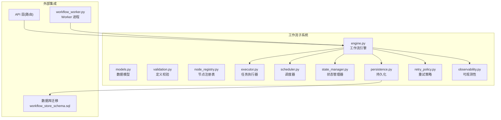
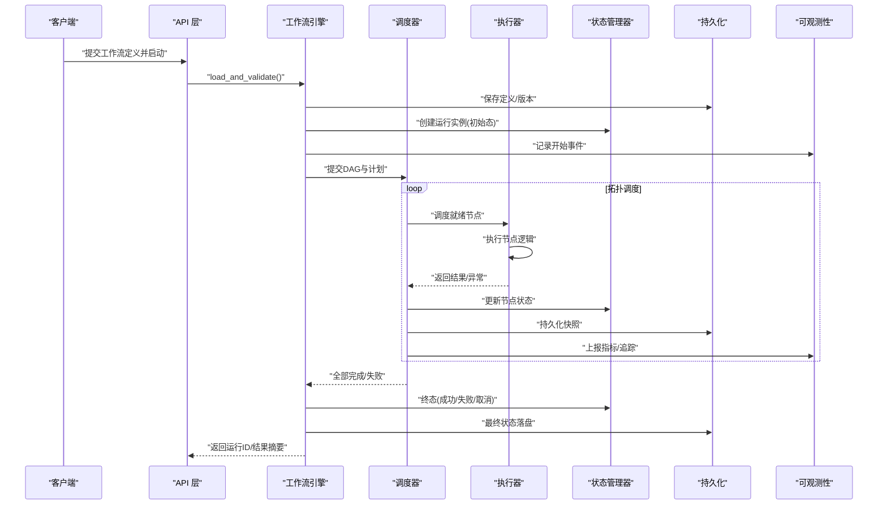
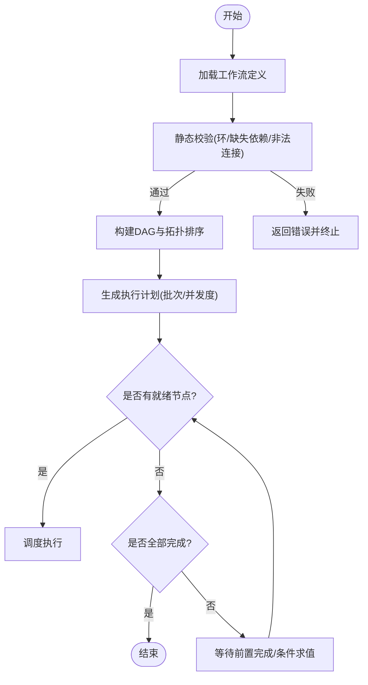
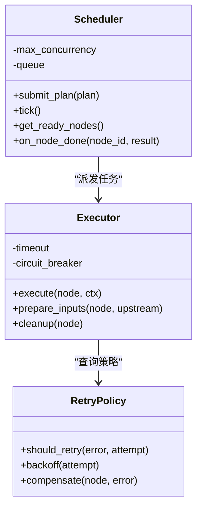
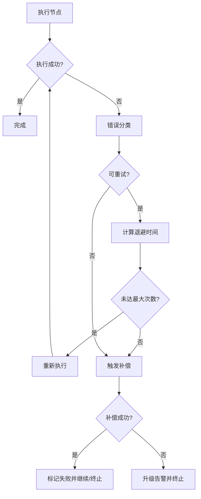
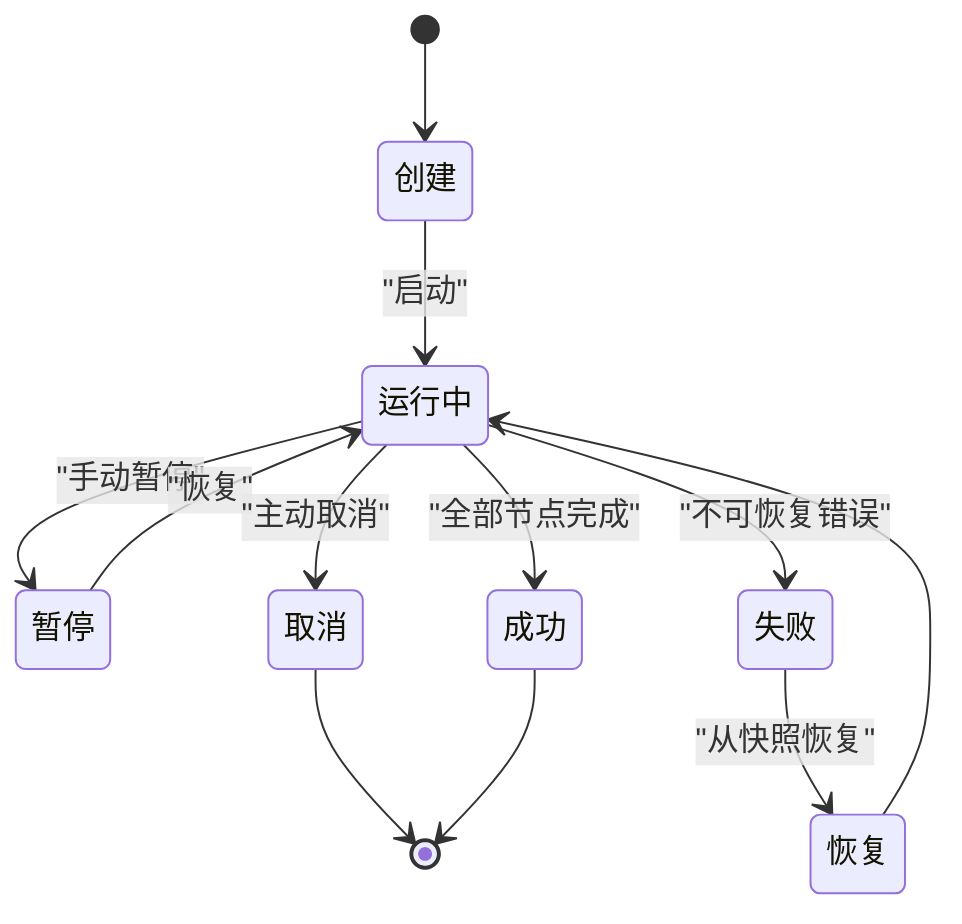
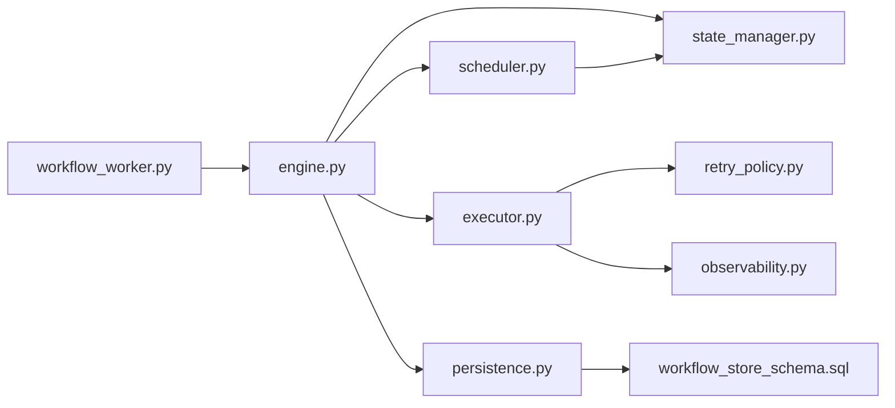

# 工作流引擎

<cite>
**本文引用的文件**   
- [backend/app/workflows/__init__.py](file://backend/app/workflows/__init__.py)
- [backend/app/workflows/engine.py](file://backend/app/workflows/engine.py)
- [backend/app/workflows/executor.py](file://backend/app/workflows/executor.py)
- [backend/app/workflows/scheduler.py](file://backend/app/workflows/scheduler.py)
- [backend/app/workflows/state_manager.py](file://backend/app/workflows/state_manager.py)
- [backend/app/workflows/persistence.py](file://backend/app/workflows/persistence.py)
- [backend/app/workflows/retry_policy.py](file://backend/app/workflows/retry_policy.py)
- [backend/app/workflows/node_registry.py](file://backend/app/workflows/node_registry.py)
- [backend/app/workflows/validation.py](file://backend/app/workflows/validation.py)
- [backend/app/workflows/models.py](file://backend/app/workflows/models.py)
- [backend/app/workflows/observability.py](file://backend/app/workflows/observability.py)
- [backend/app/workflows_worker.py](file://backend/app/workflow_worker.py)
- [backend/migrations/workflow_store_schema.sql](file://backend/migrations/workflow_store_schema.sql)
- [tests/test_workflow_runtime.py](file://tests/test_workflow_runtime.py)
- [tests/test_workflows.py](file://tests/test_workflows.py)
- [tests/test_workflow_recovery.py](file://tests/test_workflow_recovery.py)
- [tests/test_workflow_run_observability.py](file://tests/test_workflow_run_observability.py)
</cite>

## 目录
1. [简介](#简介)
2. [项目结构](#项目结构)
3. [核心组件](#核心组件)
4. [架构总览](#架构总览)
5. [详细组件分析](#详细组件分析)
6. [依赖关系分析](#依赖关系分析)
7. [性能考量](#性能考量)
8. [故障排查指南](#故障排查指南)
9. [结论](#结论)
10. [附录](#附录)

## 简介
本技术文档面向 X-Agent 的工作流引擎，围绕以下目标展开：
- 工作流定义的声明式语法：节点类型、连接关系与条件分支
- 执行引擎实现：任务调度、依赖解析与执行顺序控制
- 错误处理机制：异常捕获、重试策略与补偿操作
- 状态管理与持久化：运行期状态、恢复与快照
- 开发指南：自定义节点开发与调试技巧
- 复杂案例与性能优化建议

## 项目结构
X-Agent 的工作流子系统位于 backend/app/workflows 目录下，包含定义模型、校验、注册表、执行器、调度器、状态管理、持久化、可观测性等模块。CLI 入口与 Worker 进程分别通过 API 与后台任务驱动工作流生命周期。

图表来源
- [backend/app/workflows/engine.py](file://backend/app/workflows/engine.py)
- [backend/app/workflows/executor.py](file://backend/app/workflows/executor.py)
- [backend/app/workflows/scheduler.py](file://backend/app/workflows/scheduler.py)
- [backend/app/workflows/state_manager.py](file://backend/app/workflows/state_manager.py)
- [backend/app/workflows/persistence.py](file://backend/app/workflows/persistence.py)
- [backend/app/workflows/retry_policy.py](file://backend/app/workflows/retry_policy.py)
- [backend/app/workflows/observability.py](file://backend/app/workflows/observability.py)
- [backend/app/workflow_worker.py](file://backend/app/workflow_worker.py)
- [backend/migrations/workflow_store_schema.sql](file://backend/migrations/workflow_store_schema.sql)

章节来源
- [backend/app/workflows/__init__.py](file://backend/app/workflows/__init__.py)
- [backend/app/workflow_worker.py](file://backend/app/workflow_worker.py)

## 核心组件
- 数据模型与定义：用于描述工作流图（节点、边、条件）、运行时上下文与执行结果
- 定义校验：对声明式工作流进行静态检查（环检测、缺失依赖、非法连接等）
- 节点注册表：集中管理节点类型与工厂函数，支持扩展自定义节点
- 执行引擎：解析依赖、构建执行计划、协调调度与执行
- 任务执行器：封装单个节点的执行逻辑、输入输出映射与资源隔离
- 调度器：基于依赖拓扑的并发调度，保证执行顺序与资源上限
- 状态管理器：维护运行期状态机（创建、运行中、成功、失败、取消、恢复）
- 持久化：将工作流定义、运行实例、节点快照与审计日志落盘
- 重试策略：指数退避、最大次数、幂等性与补偿钩子
- 可观测性：指标、追踪与结构化日志

章节来源
- [backend/app/workflows/models.py](file://backend/app/workflows/models.py)
- [backend/app/workflows/validation.py](file://backend/app/workflows/validation.py)
- [backend/app/workflows/node_registry.py](file://backend/app/workflows/node_registry.py)
- [backend/app/workflows/engine.py](file://backend/app/workflows/engine.py)
- [backend/app/workflows/executor.py](file://backend/app/workflows/executor.py)
- [backend/app/workflows/scheduler.py](file://backend/app/workflows/scheduler.py)
- [backend/app/workflows/state_manager.py](file://backend/app/workflows/state_manager.py)
- [backend/app/workflows/persistence.py](file://backend/app/workflows/persistence.py)
- [backend/app/workflows/retry_policy.py](file://backend/app/workflows/retry_policy.py)
- [backend/app/workflows/observability.py](file://backend/app/workflows/observability.py)

## 架构总览
工作流从“声明式定义”到“执行完成”的关键路径如下：
- 定义阶段：用户提交 JSON/YAML 风格的工作流定义，经校验后入库
- 启动阶段：引擎加载定义，解析依赖，生成 DAG 与执行计划
- 执行阶段：调度器按拓扑序并发调度可执行节点；执行器调用具体节点实现
- 状态与持久化：每步变更写入状态与快照，支持断点续跑与审计
- 错误与恢复：触发重试或补偿，必要时回滚到最近一致快照
- 可观测性：全链路追踪与指标上报

图表来源
- [backend/app/workflows/engine.py](file://backend/app/workflows/engine.py)
- [backend/app/workflows/scheduler.py](file://backend/app/workflows/scheduler.py)
- [backend/app/workflows/executor.py](file://backend/app/workflows/executor.py)
- [backend/app/workflows/state_manager.py](file://backend/app/workflows/state_manager.py)
- [backend/app/workflows/persistence.py](file://backend/app/workflows/persistence.py)
- [backend/app/workflows/observability.py](file://backend/app/workflows/observability.py)

## 详细组件分析

### 声明式工作流定义语法
- 节点类型
  - 内置节点：如 HTTP 请求、脚本执行、LLM 调用、数据转换、条件判断、聚合、通知等
  - 自定义节点：通过注册表扩展，遵循统一接口（输入/输出契约、幂等性、超时与重试语义）
- 连接关系
  - 有向边表示上游输出到下游输入的映射
  - 支持多源汇聚与扇出并行
- 条件分支
  - 在边上配置布尔表达式或规则，根据上游输出动态选择后续路径
  - 支持短路、默认分支与互斥分支
- 参数与上下文
  - 节点参数支持模板插值，引用上游输出与全局上下文
  - 支持环境变量、密钥注入与租户隔离

章节来源
- [backend/app/workflows/models.py](file://backend/app/workflows/models.py)
- [backend/app/workflows/validation.py](file://backend/app/workflows/validation.py)
- [backend/app/workflows/node_registry.py](file://backend/app/workflows/node_registry.py)

### 执行引擎与依赖解析
- 依赖解析
  - 基于节点入度/出度构建 DAG，检测环路与孤立节点
  - 计算关键路径与并行度上限
- 执行计划
  - 将 DAG 切分为若干批次，同批内无依赖的节点可并发执行
  - 为每个节点绑定执行上下文与资源配额
- 执行顺序控制
  - 仅当所有前置节点成功时，当前节点才进入就绪队列
  - 条件边在运行时求值，决定实际可达子图

图表来源
- [backend/app/workflows/engine.py](file://backend/app/workflows/engine.py)
- [backend/app/workflows/validation.py](file://backend/app/workflows/validation.py)
- [backend/app/workflows/scheduler.py](file://backend/app/workflows/scheduler.py)

章节来源
- [backend/app/workflows/engine.py](file://backend/app/workflows/engine.py)
- [backend/app/workflows/validation.py](file://backend/app/workflows/validation.py)
- [backend/app/workflows/scheduler.py](file://backend/app/workflows/scheduler.py)

### 任务调度与执行器
- 调度器
  - 维护就绪队列与未完成集合
  - 依据资源上限与并发策略派发任务
  - 监听节点完成事件，推进拓扑进度
- 执行器
  - 负责节点生命周期：准备输入、执行、清理资源、收集输出
  - 与重试策略和补偿钩子协作，确保幂等与一致性
  - 提供超时、限流与熔断能力

图表来源
- [backend/app/workflows/scheduler.py](file://backend/app/workflows/scheduler.py)
- [backend/app/workflows/executor.py](file://backend/app/workflows/executor.py)
- [backend/app/workflows/retry_policy.py](file://backend/app/workflows/retry_policy.py)

章节来源
- [backend/app/workflows/scheduler.py](file://backend/app/workflows/scheduler.py)
- [backend/app/workflows/executor.py](file://backend/app/workflows/executor.py)
- [backend/app/workflows/retry_policy.py](file://backend/app/workflows/retry_policy.py)

### 错误处理、重试与补偿
- 异常捕获
  - 在执行器层统一捕获，分类为可重试/不可重试
  - 记录错误上下文与堆栈，便于定位
- 重试策略
  - 支持固定间隔、指数退避与抖动
  - 可针对错误类型设置不同策略
  - 限制最大重试次数与总耗时
- 补偿操作
  - 对于副作用型节点，提供补偿回调以撤销已生效影响
  - 补偿失败需记录告警并升级处理

图表来源
- [backend/app/workflows/executor.py](file://backend/app/workflows/executor.py)
- [backend/app/workflows/retry_policy.py](file://backend/app/workflows/retry_policy.py)

章节来源
- [backend/app/workflows/executor.py](file://backend/app/workflows/executor.py)
- [backend/app/workflows/retry_policy.py](file://backend/app/workflows/retry_policy.py)

### 状态管理与持久化
- 状态机
  - 运行实例状态：创建、运行中、暂停、成功、失败、取消、恢复
  - 节点状态：待执行、运行中、成功、失败、跳过、补偿中
- 持久化
  - 工作流定义与版本管理
  - 运行实例、节点快照、审计日志与指标
  - 支持断点续跑与回放
- 一致性
  - 使用事务或幂等写入保证状态一致
  - 快照粒度与频率平衡恢复成本与开销

图表来源
- [backend/app/workflows/state_manager.py](file://backend/app/workflows/state_manager.py)
- [backend/app/workflows/persistence.py](file://backend/app/workflows/persistence.py)
- [backend/migrations/workflow_store_schema.sql](file://backend/migrations/workflow_store_schema.sql)

章节来源
- [backend/app/workflows/state_manager.py](file://backend/app/workflows/state_manager.py)
- [backend/app/workflows/persistence.py](file://backend/app/workflows/persistence.py)
- [backend/migrations/workflow_store_schema.sql](file://backend/migrations/workflow_store_schema.sql)

### 可观测性与调试
- 指标
  - 运行时长、吞吐、失败率、重试次数、补偿次数
- 追踪
  - 工作流/节点级 Trace ID，跨服务关联
- 日志
  - 结构化日志，包含上下文、输入输出摘要与错误码
- 调试技巧
  - 单节点重放、局部沙箱执行、慢查询与热点识别
  - 结合快照与审计日志进行问题回溯

章节来源
- [backend/app/workflows/observability.py](file://backend/app/workflows/observability.py)
- [tests/test_workflow_run_observability.py](file://tests/test_workflow_run_observability.py)

### 自定义节点开发指南
- 步骤
  - 实现节点接口（输入/输出契约、幂等性、超时与重试语义）
  - 在注册表中注册节点类型与工厂函数
  - 编写单元测试与集成测试，覆盖正常与异常路径
- 最佳实践
  - 避免长阻塞 I/O，采用异步与非阻塞模式
  - 明确幂等键与去重策略
  - 合理拆分副作用与纯计算逻辑
- 调试
  - 启用节点级追踪与采样日志
  - 使用本地沙箱模拟外部依赖

章节来源
- [backend/app/workflows/node_registry.py](file://backend/app/workflows/node_registry.py)
- [tests/test_workflows.py](file://tests/test_workflows.py)

### 复杂工作流案例
- 典型场景
  - ETL 流水线：抽取、清洗、转换、加载，含条件分支与补偿
  - 审批流程：多人会签、超时自动通过/拒绝、回滚与归档
  - 数据质量门禁：多指标校验，失败走修复分支或告警
- 设计要点
  - 将易变逻辑下沉至节点，保持 DAG 稳定
  - 使用条件边表达业务规则，避免硬编码
  - 为关键路径设置监控与告警阈值

[本节为概念性内容，不直接分析具体文件]

## 依赖关系分析
- 组件耦合
  - 引擎强依赖调度器、执行器、状态管理与持久化
  - 执行器依赖重试策略与可观测性
  - 调度器依赖执行器与状态管理器
- 外部依赖
  - 数据库用于定义、运行实例与快照持久化
  - Worker 进程与 API 解耦，提升可扩展性与容错性

图表来源
- [backend/app/workflows/engine.py](file://backend/app/workflows/engine.py)
- [backend/app/workflows/scheduler.py](file://backend/app/workflows/scheduler.py)
- [backend/app/workflows/executor.py](file://backend/app/workflows/executor.py)
- [backend/app/workflows/state_manager.py](file://backend/app/workflows/state_manager.py)
- [backend/app/workflows/persistence.py](file://backend/app/workflows/persistence.py)
- [backend/app/workflows/retry_policy.py](file://backend/app/workflows/retry_policy.py)
- [backend/app/workflows/observability.py](file://backend/app/workflows/observability.py)
- [backend/app/workflow_worker.py](file://backend/app/workflow_worker.py)
- [backend/migrations/workflow_store_schema.sql](file://backend/migrations/workflow_store_schema.sql)

章节来源
- [backend/app/workflows/engine.py](file://backend/app/workflows/engine.py)
- [backend/app/workflows/scheduler.py](file://backend/app/workflows/scheduler.py)
- [backend/app/workflows/executor.py](file://backend/app/workflows/executor.py)
- [backend/app/workflows/state_manager.py](file://backend/app/workflows/state_manager.py)
- [backend/app/workflows/persistence.py](file://backend/app/workflows/persistence.py)
- [backend/app/workflows/retry_policy.py](file://backend/app/workflows/retry_policy.py)
- [backend/app/workflows/observability.py](file://backend/app/workflows/observability.py)
- [backend/app/workflow_worker.py](file://backend/app/workflow_worker.py)
- [backend/migrations/workflow_store_schema.sql](file://backend/migrations/workflow_store_schema.sql)

## 性能考量
- 并发与资源
  - 调整最大并发度与批次大小，匹配 CPU/IO 特性
  - 对 I/O 密集型节点使用异步执行池
- 缓存与复用
  - 对只读数据与中间结果进行缓存，减少重复计算
  - 重用连接与序列化对象，降低 GC 压力
- 存储与快照
  - 控制快照粒度与频率，权衡恢复时间与写入放大
  - 对大对象使用外存或分片存储
- 监控与调优
  - 关注 P95/P99 延迟与吞吐瓶颈
  - 利用追踪定位热点节点与慢依赖

[本节为通用指导，不直接分析具体文件]

## 故障排查指南
- 常见问题
  - 定义校验失败：环检测、缺失依赖、非法连接
  - 执行卡住：资源耗尽、死锁、外部依赖超时
  - 频繁重试：非幂等、瞬时错误未区分
  - 恢复失败：快照不一致、补偿未实现
- 诊断步骤
  - 查看运行实例与节点状态，定位失败节点
  - 检索对应 Trace 与日志，核对输入输出
  - 复现最小用例，逐步缩小范围
  - 检查重试策略与补偿逻辑是否符合预期
- 工具与测试
  - 使用单节点重放与沙箱执行
  - 参考相关测试用例验证行为

章节来源
- [backend/app/workflows/validation.py](file://backend/app/workflows/validation.py)
- [backend/app/workflows/executor.py](file://backend/app/workflows/executor.py)
- [backend/app/workflows/retry_policy.py](file://backend/app/workflows/retry_policy.py)
- [backend/app/workflows/state_manager.py](file://backend/app/workflows/state_manager.py)
- [tests/test_workflow_runtime.py](file://tests/test_workflow_runtime.py)
- [tests/test_workflow_recovery.py](file://tests/test_workflow_recovery.py)

## 结论
X-Agent 工作流引擎通过声明式定义、严格的依赖解析与可观测的执行过程，提供了高可靠、可扩展的流程编排能力。配合完善的错误处理、重试与补偿机制，以及健壮的状态管理与持久化方案，能够支撑复杂的业务场景。建议在开发中遵循幂等与最小副作用原则，结合监控与测试保障稳定性与性能。

[本节为总结性内容，不直接分析具体文件]

## 附录
- 术语
  - 工作流：由节点与边构成的有向无环图，描述业务流程
  - 节点：可执行的原子单元，具备输入/输出契约
  - 边：连接上下游的数据与控制流
  - 条件分支：基于运行时数据的动态路径选择
  - 快照：运行期状态的持久化副本，用于恢复
- 参考测试
  - 运行期行为与边界条件
  - 恢复与补偿流程
  - 可观测性指标与追踪

章节来源
- [tests/test_workflow_runtime.py](file://tests/test_workflow_runtime.py)
- [tests/test_workflow_recovery.py](file://tests/test_workflow_recovery.py)
- [tests/test_workflow_run_observability.py](file://tests/test_workflow_run_observability.py)