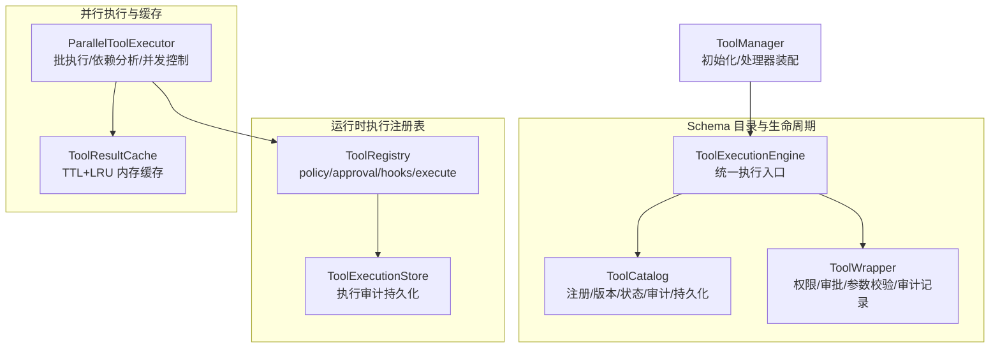
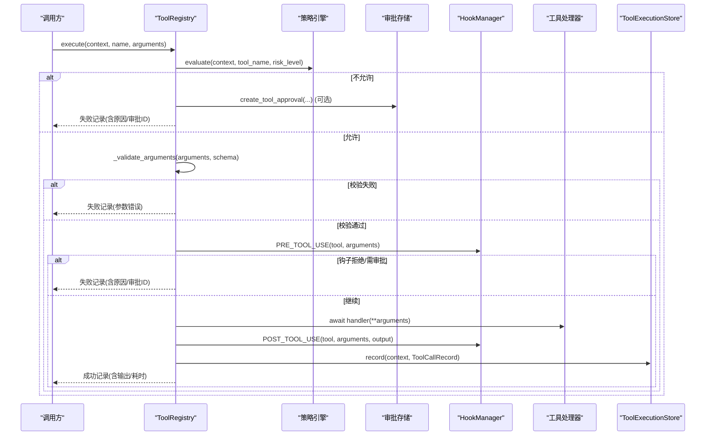
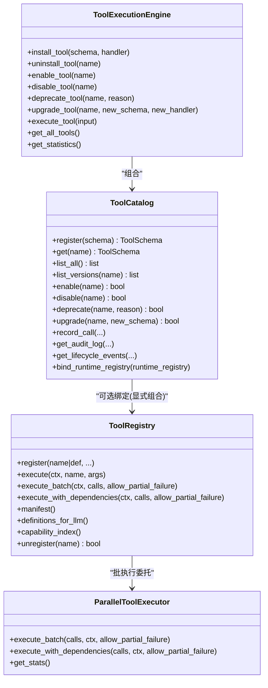
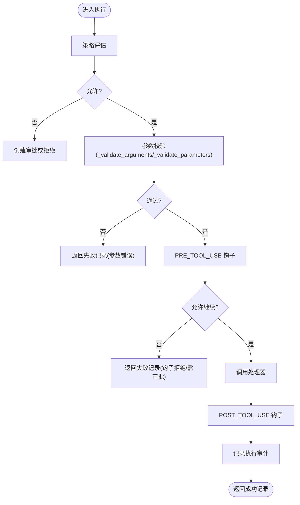
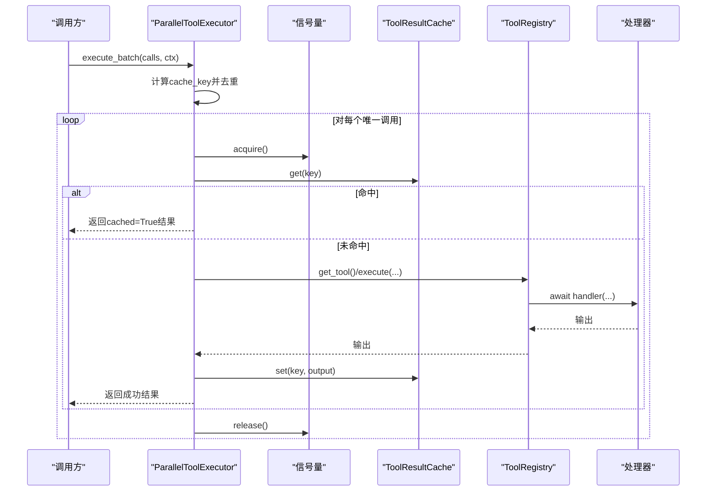
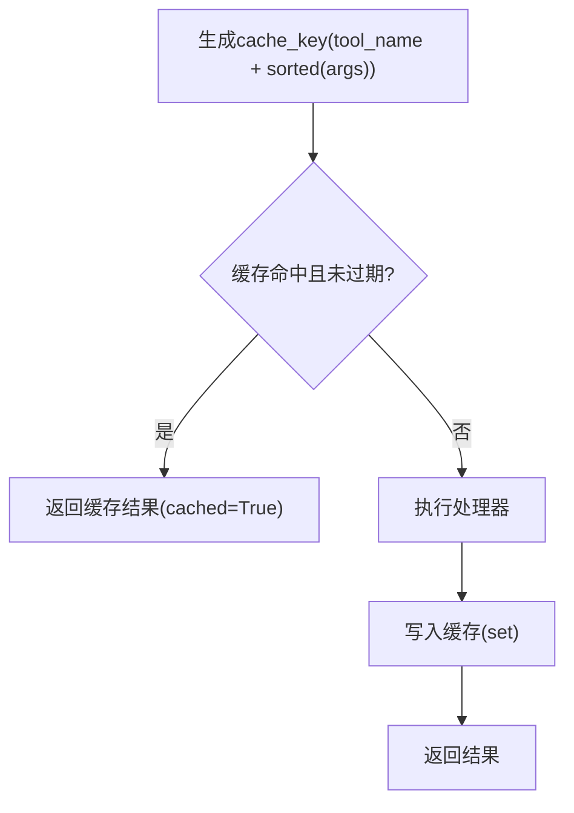
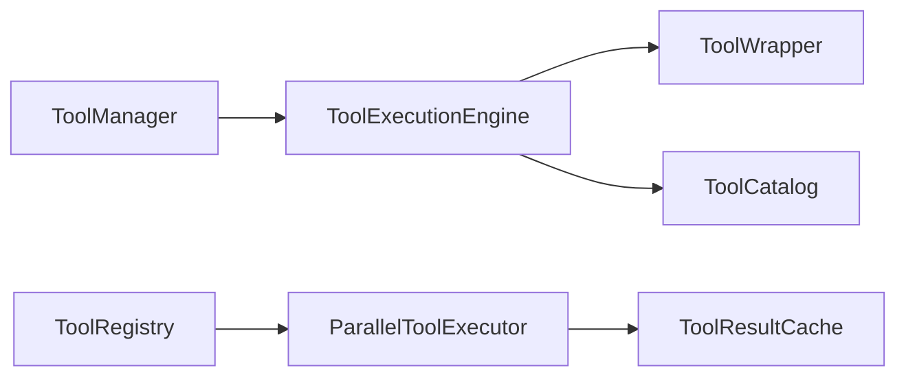

# 工具系统

<cite>
**本文引用的文件**   
- [backend/app/core/tools.py](file://backend/app/core/tools.py)
- [backend/app/core/tool_registry.py](file://backend/app/core/tool_registry.py)
- [backend/app/core/tool_executor.py](file://backend/app/core/tool_executor.py)
- [backend/app/core/parallel/tool_executor.py](file://backend/app/core/parallel/tool_executor.py)
- [backend/app/core/tool_manager.py](file://backend/app/core/tool_manager.py)
</cite>

## 目录
1. [简介](#简介)
2. [项目结构](#项目结构)
3. [核心组件](#核心组件)
4. [架构总览](#架构总览)
5. [详细组件分析](#详细组件分析)
6. [依赖关系分析](#依赖关系分析)
7. [性能与并发](#性能与并发)
8. [故障排查指南](#故障排查指南)
9. [结论](#结论)
10. [附录：开发指南与示例](#附录开发指南与示例)

## 简介
本文件面向 X-Agent 的工具系统，系统性阐述以下能力：
- 工具注册与发现机制（动态加载、依赖解析、版本管理）
- 参数验证系统（类型检查、约束校验、默认值处理）
- 执行引擎（并发控制、资源隔离、超时管理）
- 结果缓存机制（缓存策略与失效策略）
- 工具开发指南（接口规范、测试方法、发布流程）
- 具体工具开发与集成模式示例

## 项目结构
X-Agent 工具系统由“运行时执行注册表”和“Schema 目录/生命周期管理”两条主线组成，并通过执行引擎与并行执行器协同工作。

图示来源
- [backend/app/core/tools.py:213-491](file://backend/app/core/tools.py#L213-L491)
- [backend/app/core/tool_registry.py:72-440](file://backend/app/core/tool_registry.py#L72-L440)
- [backend/app/core/tool_executor.py:49-201](file://backend/app/core/tool_executor.py#L49-L201)
- [backend/app/core/parallel/tool_executor.py:113-496](file://backend/app/core/parallel/tool_executor.py#L113-L496)
- [backend/app/core/tool_manager.py:16-68](file://backend/app/core/tool_manager.py#L16-L68)

章节来源
- [backend/app/core/tools.py:213-491](file://backend/app/core/tools.py#L213-L491)
- [backend/app/core/tool_registry.py:72-440](file://backend/app/core/tool_registry.py#L72-L440)
- [backend/app/core/tool_executor.py:49-201](file://backend/app/core/tool_executor.py#L49-L201)
- [backend/app/core/parallel/tool_executor.py:113-496](file://backend/app/core/parallel/tool_executor.py#L113-L496)
- [backend/app/core/tool_manager.py:16-68](file://backend/app/core/tool_manager.py#L16-L68)

## 核心组件
- 运行时执行注册表 ToolRegistry
  - 职责：工具定义、策略评估、审批流、钩子扩展、参数校验、执行编排、执行审计落盘。
  - 关键能力：
    - 注册：支持直接传入 ToolDefinition 或按名称/描述/处理器等元数据注册；自动从函数签名推导参数 schema。
    - 执行：策略评估→审批→参数校验→PRE_TOOL_USE 钩子→调用 handler→POST_TOOL_USE 钩子→审计记录。
    - 批量执行：提供 execute_batch / execute_with_dependencies，内部委托 ParallelToolExecutor。
    - 缓存：懒加载 ToolResultCache，供批执行使用。
- Schema 目录 ToolCatalog
  - 职责：工具元数据目录、版本历史、启用/禁用/弃用、权限范围、审计日志与生命周期事件、磁盘持久化。
  - 与运行时的关系：通过 bind_runtime_registry 显式组合唯一运行时执行注册表，避免平行注册表。
- 执行引擎 ToolExecutionEngine + 包装器 ToolWrapper
  - 职责：统一安装/卸载/启停/升级工具；封装权限检查、审批检查、参数校验、异步/同步处理器适配、审计记录。
- 并行执行器 ParallelToolExecutor
  - 职责：批执行、依赖图分析与分层执行、并发度控制（信号量）、超时、重试退避、去重与缓存命中标记。
- 管理器 ToolManager
  - 职责：启动时注册标准工具与处理器，对外暴露统一的执行与管理 API。

章节来源
- [backend/app/core/tools.py:213-491](file://backend/app/core/tools.py#L213-L491)
- [backend/app/core/tool_registry.py:72-440](file://backend/app/core/tool_registry.py#L72-L440)
- [backend/app/core/tool_executor.py:49-201](file://backend/app/core/tool_executor.py#L49-L201)
- [backend/app/core/parallel/tool_executor.py:113-496](file://backend/app/core/parallel/tool_executor.py#L113-L496)
- [backend/app/core/tool_manager.py:16-68](file://backend/app/core/tool_manager.py#L16-L68)

## 架构总览
下图展示一次典型工具调用的端到端流程，包括策略、审批、钩子、执行与审计。

图示来源
- [backend/app/core/tools.py:340-491](file://backend/app/core/tools.py#L340-L491)
- [backend/app/core/tools.py:493-597](file://backend/app/core/tools.py#L493-L597)
- [backend/app/core/tools.py:160-211](file://backend/app/core/tools.py#L160-L211)

## 详细组件分析

### 工具注册与发现机制
- 动态注册
  - ToolRegistry.register 支持两种调用约定：直接传入 ToolDefinition，或按 name/description/handler/risk_level/scope/schema 注册；未提供 schema 时自动从函数签名推导。
  - ToolCatalog.register 负责将 ToolSchema 写入当前版本并维护版本历史，同时记录生命周期事件与持久化。
- 依赖解析
  - 批执行场景下，ParallelToolExecutor 基于依赖分析构建 DAG 并按层并行执行，检测环依赖并抛出异常。
- 版本管理
  - ToolCatalog 提供 list_versions、upgrade、enable/disable/deprecate 等接口，所有变更均记录生命周期事件并持久化。
- 发现与索引
  - ToolRegistry.manifest / definitions_for_llm / capability_index 提供面向 LLM 的函数描述、风险等级、所需作用域与参数 schema 的统一视图。

图示来源
- [backend/app/core/tools.py:213-491](file://backend/app/core/tools.py#L213-L491)
- [backend/app/core/tool_registry.py:72-440](file://backend/app/core/tool_registry.py#L72-L440)
- [backend/app/core/tool_executor.py:203-280](file://backend/app/core/tool_executor.py#L203-L280)
- [backend/app/core/parallel/tool_executor.py:113-496](file://backend/app/core/parallel/tool_executor.py#L113-L496)

章节来源
- [backend/app/core/tools.py:213-491](file://backend/app/core/tools.py#L213-L491)
- [backend/app/core/tool_registry.py:72-440](file://backend/app/core/tool_registry.py#L72-L440)
- [backend/app/core/tool_executor.py:203-280](file://backend/app/core/tool_executor.py#L203-L280)
- [backend/app/core/parallel/tool_executor.py:113-496](file://backend/app/core/parallel/tool_executor.py#L113-L496)

### 参数验证系统
- 类型检查
  - ToolWrapper._validate_parameters 对 string/number/boolean 进行基础类型校验。
- 约束验证
  - 支持 min_length/max_length 长度约束与 enum 枚举约束。
- 默认值处理
  - 当 ToolRegistry.register 未提供 parameters_schema 时，会从处理器函数签名自动推导参数信息（包含默认值），用于后续校验与 LLM 提示。
- 高级校验
  - ToolRegistry.execute 在策略与审批通过后，调用 _validate_arguments 完成最终参数校验，失败则返回带错误信息的执行记录。

图示来源
- [backend/app/core/tools.py:340-491](file://backend/app/core/tools.py#L340-L491)
- [backend/app/core/tool_executor.py:172-201](file://backend/app/core/tool_executor.py#L172-L201)

章节来源
- [backend/app/core/tools.py:340-491](file://backend/app/core/tools.py#L340-L491)
- [backend/app/core/tool_executor.py:172-201](file://backend/app/core/tool_executor.py#L172-L201)

### 执行引擎：并发控制、资源隔离与超时管理
- 并发控制
  - ParallelToolExecutor 使用 asyncio.Semaphore 限制最大并发数；批执行前进行同批次内 cache_key 去重，避免重复执行。
- 资源隔离
  - 工具处理器以协程方式执行；同步处理器通过事件循环 executor 运行，避免阻塞主循环。
- 超时管理
  - 每个 ToolCall 可配置 timeout_seconds；_call_tool 使用 wait_for 包裹执行，超时抛出 TimeoutError 并被上层捕获为失败。
- 重试与退避
  - 支持 max_retries 与指数退避（2^attempt），提升不稳定外部依赖的鲁棒性。
- 依赖解析与分层执行
  - 基于依赖分析生成 DAG 与执行计划，逐层并行执行，并在不允许部分失败时遇到首个失败即中断。

图示来源
- [backend/app/core/parallel/tool_executor.py:138-300](file://backend/app/core/parallel/tool_executor.py#L138-L300)
- [backend/app/core/parallel/tool_executor.py:349-418](file://backend/app/core/parallel/tool_executor.py#L349-L418)
- [backend/app/core/parallel/tool_executor.py:420-456](file://backend/app/core/parallel/tool_executor.py#L420-L456)

章节来源
- [backend/app/core/parallel/tool_executor.py:113-496](file://backend/app/core/parallel/tool_executor.py#L113-L496)

### 结果缓存机制
- 缓存策略
  - 基于 ToolResultCache 的 TTL + LRU 淘汰策略；key 由 tool_name 与 JSON 序列化后的参数（排序键）拼接后哈希得到。
- 失效策略
  - 读取时若超过 TTL 则视为过期并删除；写入时若达到上限则移除最旧条目。
- 批内去重
  - 同一批中相同 key 的调用只执行一次，其余复用首次结果并标记 cached=True，避免并发竞态导致的重复执行。

图示来源
- [backend/app/core/parallel/tool_executor.py:61-111](file://backend/app/core/parallel/tool_executor.py#L61-L111)
- [backend/app/core/parallel/tool_executor.py:457-467](file://backend/app/core/parallel/tool_executor.py#L457-L467)

章节来源
- [backend/app/core/parallel/tool_executor.py:61-111](file://backend/app/core/parallel/tool_executor.py#L61-L111)
- [backend/app/core/parallel/tool_executor.py:457-467](file://backend/app/core/parallel/tool_executor.py#L457-L467)

## 依赖关系分析
- 模块耦合
  - ToolManager 组合 ToolExecutionEngine 与 ToolCatalog，负责初始化与处理器装配。
  - ToolExecutionEngine 组合 ToolWrapper 与 ToolCatalog，提供统一安装/启停/升级/查询接口。
  - ToolRegistry 作为运行时执行咽喉点，独立于 ToolCatalog 的职责边界清晰。
  - ParallelToolExecutor 依赖 ToolRegistry 获取工具并执行，同时依赖 ToolResultCache。
- 潜在循环依赖
  - 通过延迟导入与显式组合避免循环依赖（例如并行执行器与注册表的解耦）。
- 外部依赖
  - 策略引擎、审批存储、钩子管理器均为可选注入，便于轻量场景无侵入使用。

图示来源
- [backend/app/core/tool_manager.py:16-68](file://backend/app/core/tool_manager.py#L16-L68)
- [backend/app/core/tool_executor.py:203-280](file://backend/app/core/tool_executor.py#L203-L280)
- [backend/app/core/parallel/tool_executor.py:113-496](file://backend/app/core/parallel/tool_executor.py#L113-L496)
- [backend/app/core/tools.py:213-491](file://backend/app/core/tools.py#L213-L491)

章节来源
- [backend/app/core/tool_manager.py:16-68](file://backend/app/core/tool_manager.py#L16-L68)
- [backend/app/core/tool_executor.py:203-280](file://backend/app/core/tool_executor.py#L203-L280)
- [backend/app/core/parallel/tool_executor.py:113-496](file://backend/app/core/parallel/tool_executor.py#L113-L496)
- [backend/app/core/tools.py:213-491](file://backend/app/core/tools.py#L213-L491)

## 性能与并发
- 并发度可调：通过 ParallelToolExecutor 构造参数 max_concurrent 控制。
- 批内去重：减少重复 I/O 与 CPU 开销。
- 分层并行：依赖图分层执行最大化吞吐。
- 超时与重试：保护外部依赖抖动，避免雪崩。
- 统计指标：BatchExecutionStats 提供总耗时、并行因子、缓存命中率等观测维度。

[本节为通用指导，不直接分析具体文件]

## 故障排查指南
- 常见错误定位
  - 未知工具：ToolRegistry.execute 在未找到工具时返回失败记录，检查注册是否完成。
  - 策略拒绝/需审批：查看 ToolCallRecord.policy 与 error 字段，必要时走审批流程。
  - 参数校验失败：关注 error 中的参数名与约束说明，修正输入。
  - 钩子拦截：PRE_TOOL_USE 可能拒绝或改写参数，检查钩子逻辑。
  - 超时/重试耗尽：确认工具实现耗时与超时阈值，必要时调整 max_retries 与 timeout_seconds。
- 审计与回溯
  - ToolExecutionStore 持久化每次执行的摘要，可按 trace_id 检索链路。
  - ToolCatalog 提供审计日志与生命周期事件，便于追踪工具变更与调用趋势。

章节来源
- [backend/app/core/tools.py:340-491](file://backend/app/core/tools.py#L340-L491)
- [backend/app/core/tools.py:160-211](file://backend/app/core/tools.py#L160-L211)
- [backend/app/core/tool_registry.py:278-347](file://backend/app/core/tool_registry.py#L278-L347)

## 结论
X-Agent 工具系统在“运行时执行注册表”与“Schema 目录”之间建立了清晰的职责边界，结合策略、审批、钩子、参数校验、并发控制、超时与缓存，形成高可用、可观测、可扩展的工具执行体系。通过 ToolManager 的一体化装配与 ToolCatalog 的版本/生命周期管理，开发者可以安全高效地扩展工具生态。

[本节为总结性内容，不直接分析具体文件]

## 附录：开发指南与示例

### 工具接口规范
- 处理器签名
  - 推荐为 async def handler(**kwargs)，以便被异步执行器直接调用；也兼容同步函数，执行器会自动在线程池中运行。
- 元数据声明
  - 通过 ToolRegistry.register 或 ToolCatalog.register 声明 name、description、risk_level、required_scope、parameters_schema。
- 返回值
  - 建议返回结构化 dict，便于审计与下游消费。

章节来源
- [backend/app/core/tools.py:233-258](file://backend/app/core/tools.py#L233-L258)
- [backend/app/core/tool_registry.py:101-127](file://backend/app/core/tool_registry.py#L101-L127)

### 参数验证与默认值
- 类型与约束
  - 使用 ToolWrapper._validate_parameters 或 ToolRegistry._validate_arguments 进行校验；支持字符串长度、数值、布尔与枚举约束。
- 默认值
  - 未显式提供 parameters_schema 时，从函数签名自动推导，包含默认值。

章节来源
- [backend/app/core/tool_executor.py:172-201](file://backend/app/core/tool_executor.py#L172-L201)
- [backend/app/core/tools.py:233-258](file://backend/app/core/tools.py#L233-L258)

### 并发与超时配置
- 并发度
  - 通过 ParallelToolExecutor(max_concurrent=N) 设置。
- 超时与重试
  - ToolCall.timeout_seconds 与 max_retries 控制单次调用行为；指数退避降低瞬时失败影响。

章节来源
- [backend/app/core/parallel/tool_executor.py:116-136](file://backend/app/core/parallel/tool_executor.py#L116-L136)
- [backend/app/core/parallel/tool_executor.py:349-418](file://backend/app/core/parallel/tool_executor.py#L349-L418)

### 缓存策略与失效
- Key 生成
  - tool_name + 排序后的参数 JSON 的 SHA256。
- 失效
  - TTL 过期删除；容量满时淘汰最旧项。
- 批内去重
  - 相同 key 仅执行一次，其余复用并标记 cached=True。

章节来源
- [backend/app/core/parallel/tool_executor.py:61-111](file://backend/app/core/parallel/tool_executor.py#L61-L111)
- [backend/app/core/parallel/tool_executor.py:457-467](file://backend/app/core/parallel/tool_executor.py#L457-L467)

### 测试方法
- 单元测试
  - 针对 ToolWrapper._validate_parameters 覆盖类型、长度、枚举分支。
  - 模拟 ToolRegistry.execute 的策略/审批/钩子路径，断言 ToolCallRecord.success/error/policy。
- 集成测试
  - 使用 ToolManager.initialize 装配处理器，调用 execute_tool 验证端到端流程。
  - 使用 ParallelToolExecutor.execute_with_dependencies 验证依赖图与分层执行。

章节来源
- [backend/app/core/tool_executor.py:49-201](file://backend/app/core/tool_executor.py#L49-L201)
- [backend/app/core/tool_manager.py:24-68](file://backend/app/core/tool_manager.py#L24-L68)
- [backend/app/core/parallel/tool_executor.py:170-222](file://backend/app/core/parallel/tool_executor.py#L170-L222)

### 发布流程
- 版本升级
  - 使用 ToolCatalog.upgrade 提交新版本 Schema，保留历史版本与生命周期事件。
- 启停与弃用
  - enable/disable/deprecate 配合 ToolCatalog.get_statistics 监控影响面。
- 审计与回溯
  - 通过 ToolCatalog.get_audit_log 与 get_lifecycle_events 审查变更与调用情况。

章节来源
- [backend/app/core/tool_registry.py:243-268](file://backend/app/core/tool_registry.py#L243-L268)
- [backend/app/core/tool_registry.py:177-241](file://backend/app/core/tool_registry.py#L177-L241)
- [backend/app/core/tool_registry.py:349-367](file://backend/app/core/tool_registry.py#L349-L367)

### 集成模式示例
- 标准工具装配
  - ToolManager.initialize 遍历 STANDARD_TOOLS 注册 Schema，再注册对应处理器。
- 浏览器/桌面/记忆/工作流/插件等处理器
  - 通过 ToolExecutionEngine.wrapper.register_handler 将业务处理器映射到工具名。
- 批执行与依赖
  - 上层构造 ToolCall 列表，调用 ParallelToolExecutor.execute_with_dependencies 获得按 call_id 索引的结果。

章节来源
- [backend/app/core/tool_manager.py:24-68](file://backend/app/core/tool_manager.py#L24-L68)
- [backend/app/core/tool_executor.py:210-237](file://backend/app/core/tool_executor.py#L210-L237)
- [backend/app/core/parallel/tool_executor.py:170-222](file://backend/app/core/parallel/tool_executor.py#L170-L222)