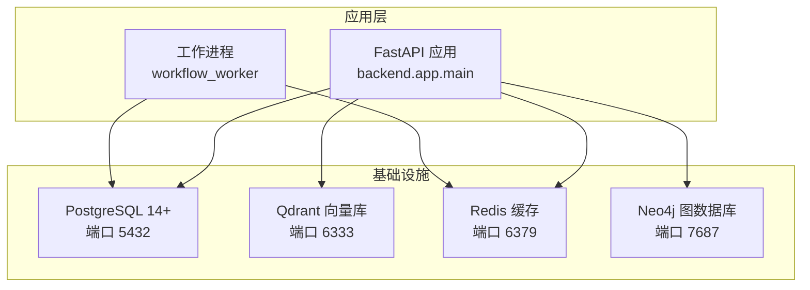
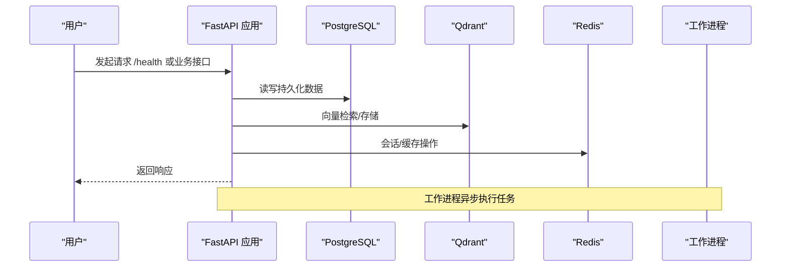
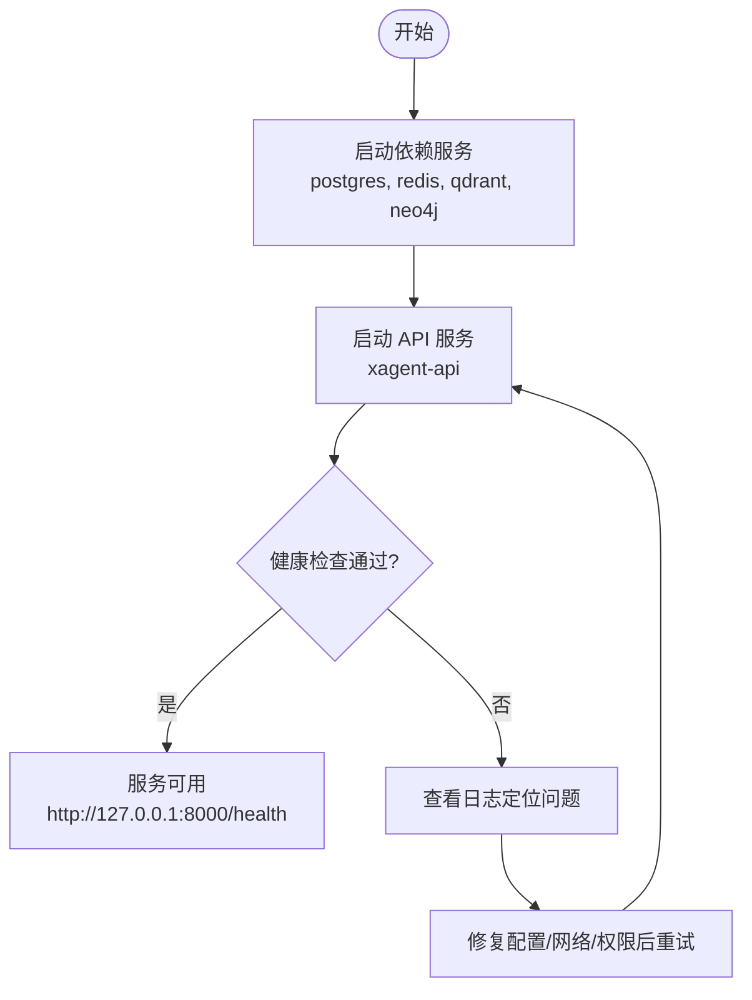
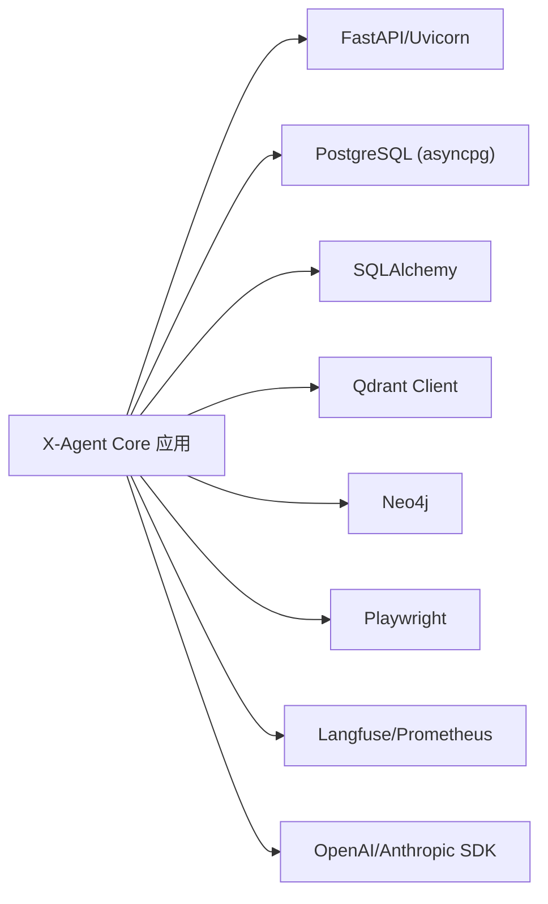

# 快速开始

<cite>
**本文引用的文件**
- [README.md](file://README.md)
- [docker-compose.yml](file://docker-compose.yml)
- [requirements.txt](file://requirements.txt)
- [backend/app/settings.py](file://backend/app/settings.py)
- [backend/migrations/init_schema.sql](file://backend/migrations/init_schema.sql)
- [backend/local/migration.py](file://backend/local/migration.py)
- [examples/README.md](file://examples/README.md)
- [docs/operations/setup/INSTALL.md](file://docs/operations/setup/INSTALL.md)
- [docs/operations/deployment/DEPLOYMENT.md](file://docs/operations/deployment/DEPLOYMENT.md)
</cite>

## 目录
1. [简介](#简介)
2. [项目结构](#项目结构)
3. [核心组件](#核心组件)
4. [架构总览](#架构总览)
5. [详细组件分析](#详细组件分析)
6. [依赖分析](#依赖分析)
7. [性能考虑](#性能考虑)
8. [故障排除指南](#故障排除指南)
9. [结论](#结论)
10. [附录](#附录)

## 简介
本指南面向首次接触 X-Agent Core 的用户，目标是在 30 分钟内完成本地开发环境搭建并运行第一个示例。内容覆盖：
- 环境要求（Python 3.11+、PostgreSQL 14+、Docker）
- 依赖安装与虚拟环境
- 环境变量配置与数据库初始化
- 本地开发全流程（从克隆仓库到启动服务）
- Docker Compose 一键部署简化方案
- 常见问题与排障建议

## 项目结构
X-Agent Core 采用分层模块化架构：API 层（FastAPI）、核心服务层（LLM 路由、记忆系统、策略引擎等）、基础设施层（PostgreSQL、Qdrant、Playwright、Langfuse 等）。根目录提供 docker-compose.yml 用于编排基础服务与应用进程；后端设置通过 Settings 类集中加载环境变量；迁移脚本负责数据库初始化。

图表来源
- [docker-compose.yml:110-182](file://docker-compose.yml#L110-L182)
- [docker-compose.yml:184-264](file://docker-compose.yml#L184-L264)

章节来源
- [README.md:75-95](file://README.md#L75-L95)
- [docker-compose.yml:1-281](file://docker-compose.yml#L1-L281)

## 核心组件
- 应用设置与校验：Settings 类统一读取 XAGENT_* 环境变量，并在生产模式下对敏感项进行强校验与 fail-fast 保护。
- 数据库初始化：PostgreSQL 初始 schema 由 init_schema.sql 提供；本地 SQLite 初始化可通过 migration 工具完成。
- 容器编排：docker-compose.yml 定义 PostgreSQL、Redis、Qdrant、Neo4j、API 服务与工作进程，并通过健康检查保障启动顺序。
- 可运行示例：examples 目录提供可直接运行的示例脚本，便于快速验证能力。

章节来源
- [backend/app/settings.py:13-218](file://backend/app/settings.py#L13-L218)
- [backend/migrations/init_schema.sql:1-34](file://backend/migrations/init_schema.sql#L1-L34)
- [backend/local/migration.py:480-510](file://backend/local/migration.py#L480-L510)
- [docker-compose.yml:1-281](file://docker-compose.yml#L1-L281)
- [examples/README.md:1-64](file://examples/README.md#L1-L64)

## 架构总览
下图展示了本地开发与 Docker Compose 部署时的关键交互关系：客户端访问 FastAPI 应用，应用连接数据库、向量库与缓存；工作进程异步处理任务。

图表来源
- [docker-compose.yml:110-182](file://docker-compose.yml#L110-L182)
- [docker-compose.yml:184-264](file://docker-compose.yml#L184-L264)

## 详细组件分析

### 环境与依赖准备
- Python 版本要求：3.11 及以上
- 数据库：PostgreSQL 14+
- 可选：Docker 与 Docker Compose（推荐用于本地快速拉起依赖服务）
- 依赖清单：requirements.txt 包含生产所需的核心依赖与可选扩展

步骤概览：
- 克隆仓库并进入目录
- 创建并激活虚拟环境
- 安装依赖（含开发依赖）
- 复制并编辑 .env 配置文件
- 初始化数据库（自动或手动）
- 启动服务并验证健康检查

章节来源
- [README.md:32-73](file://README.md#L32-L73)
- [requirements.txt:1-138](file://requirements.txt#L1-L138)
- [docs/operations/setup/INSTALL.md:59-123](file://docs/operations/setup/INSTALL.md#L59-L123)

### 环境变量配置要点
- 所有应用配置优先使用 XAGENT_* 前缀变量
- 关键变量包括：数据库连接、Qdrant URL、LLM 后端与模型、审计 HMAC、JWT 密钥、加密密钥、CORS 源、是否启用高风险工具等
- 生产模式强制校验：禁止默认密钥、最小长度与复杂度要求、禁用内存/SQLite 作为主存储

章节来源
- [docs/operations/deployment/DEPLOYMENT.md:5-8](file://docs/operations/deployment/DEPLOYMENT.md#L5-L8)
- [backend/app/settings.py:73-131](file://backend/app/settings.py#L73-L131)
- [backend/app/settings.py:154-199](file://backend/app/settings.py#L154-L199)

### 数据库初始化
- PostgreSQL 初始化：init_schema.sql 提供必要表结构与索引
- 本地 SQLite 初始化：可通过 migration 工具调用 initialize_local_database 完成
- 自动迁移：首次启动时根据配置自动创建本地存储（如 SQLite），也可显式初始化

章节来源
- [backend/migrations/init_schema.sql:1-34](file://backend/migrations/init_schema.sql#L1-L34)
- [backend/local/migration.py:480-510](file://backend/local/migration.py#L480-L510)
- [README.md:66-73](file://README.md#L66-L73)

### Docker Compose 部署简化方案
- 一键拉起依赖：PostgreSQL、Redis、Qdrant、Neo4j
- 启动 API 与服务：xagent-api、xagent-worker、xagent-beat
- 健康检查：各服务具备 healthcheck，确保依赖就绪后再启动应用
- 端口映射：API 默认 8000，PostgreSQL 5432，Qdrant 6333，Neo4j 7687

图表来源
- [docker-compose.yml:1-281](file://docker-compose.yml#L1-L281)

章节来源
- [docs/operations/deployment/DEPLOYMENT.md:63-92](file://docs/operations/deployment/DEPLOYMENT.md#L63-L92)
- [docker-compose.yml:110-182](file://docker-compose.yml#L110-L182)

### 运行第一个示例
- 在 examples 目录下提供多个真实可运行的示例脚本
- 无需外部 API Key 时可跳过在线示例，或使用 mock LLM 快速验证
- 浏览器自动化示例需先安装 Chromium 浏览器驱动

章节来源
- [examples/README.md:1-64](file://examples/README.md#L1-L64)

## 依赖分析
- 运行时核心依赖：FastAPI、Uvicorn、SQLAlchemy、asyncpg、Pydantic、Pydantic-Settings、Qdrant Client、Neo4j、Playwright、Langfuse、OpenAI/Anthropic SDK、Prometheus 客户端等
- 可选依赖：本地嵌入（sentence-transformers）、Docker 沙箱隔离、PDF 导出（reportlab）、token 计数（tiktoken）
- 未使用依赖说明：Celery 依赖保留但当前无 Celery 应用，工作进程以 asyncio 方式运行

图表来源
- [requirements.txt:1-138](file://requirements.txt#L1-L138)

章节来源
- [requirements.txt:1-138](file://requirements.txt#L1-L138)

## 性能考虑
- 生产环境建议使用多 worker 的 ASGI 服务器（如 Gunicorn + UvicornWorker）
- 合理配置数据库连接池大小与最大溢出
- 启用 Redis 缓存以提升会话与热点数据访问性能
- 针对 PostgreSQL 进行必要的索引优化与定期维护（VACUUM ANALYZE）

[本节为通用指导，不直接分析具体文件]

## 故障排除指南
- Python 版本错误：确认已安装 3.11+，必要时升级或切换版本管理器
- PostgreSQL 连接失败：检查服务状态、端口占用与认证信息
- 虚拟环境问题：确保已激活 venv，重新安装包
- 端口冲突：查找占用进程并终止，或更换端口
- Qdrant 连接失败：确认容器运行与端口映射，检查健康端点
- 缺失依赖：重新安装依赖或单独安装指定包

章节来源
- [docs/operations/setup/INSTALL.md:349-447](file://docs/operations/setup/INSTALL.md#L349-L447)

## 结论
通过以上步骤，您可以在 30 分钟内完成 X-Agent Core 的本地开发环境搭建并运行第一个示例。推荐使用 Docker Compose 快速拉起依赖服务，结合 Settings 的环境变量管理实现灵活配置。生产部署请遵循安全与性能最佳实践，确保 TLS 终止、密钥管理与存储后端符合生产要求。

[本节为总结性内容，不直接分析具体文件]

## 附录
- 安装与部署参考：详见 INSTALL.md 与 DEPLOYMENT.md
- 示例与教程：参见 examples/README.md 与 docs/developer/sdk/EXAMPLES.md
- 架构与设计：参考 README.md 中的架构描述与文档索引

章节来源
- [docs/operations/setup/INSTALL.md:1-123](file://docs/operations/setup/INSTALL.md#L1-L123)
- [docs/operations/deployment/DEPLOYMENT.md:1-92](file://docs/operations/deployment/DEPLOYMENT.md#L1-L92)
- [examples/README.md:1-64](file://examples/README.md#L1-L64)
- [README.md:97-110](file://README.md#L97-L110)