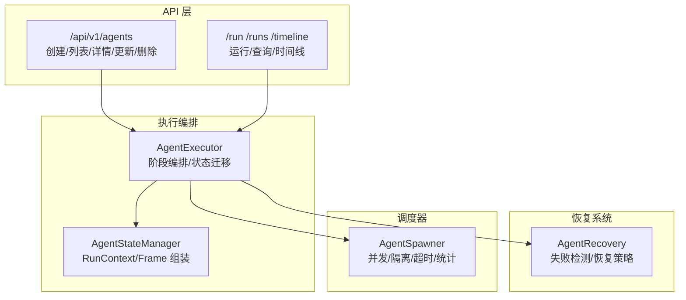
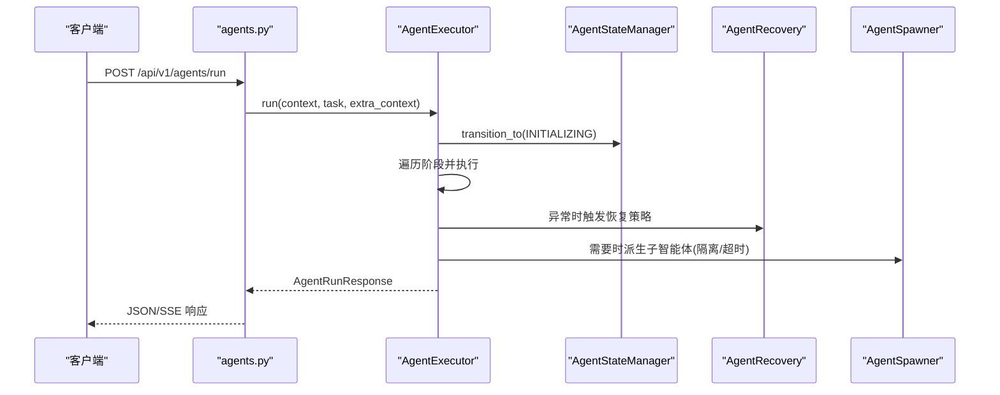
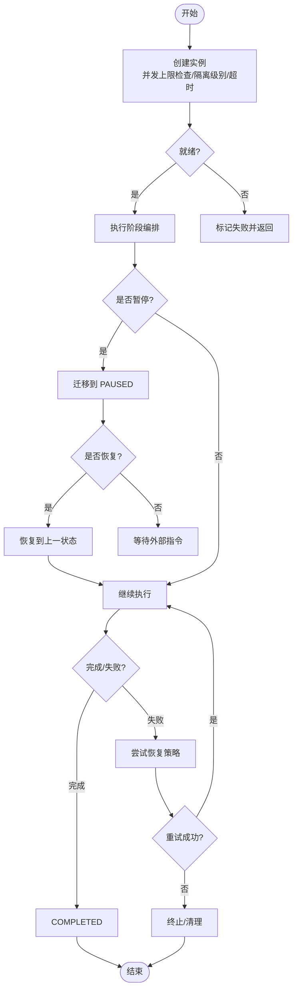
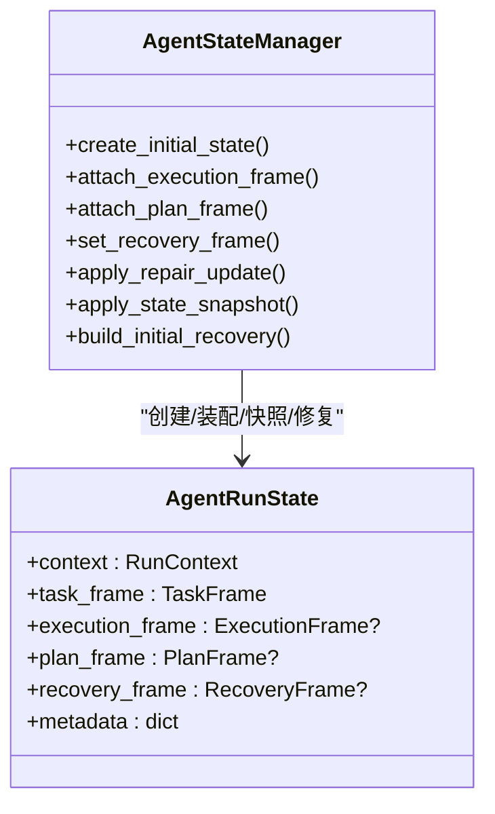
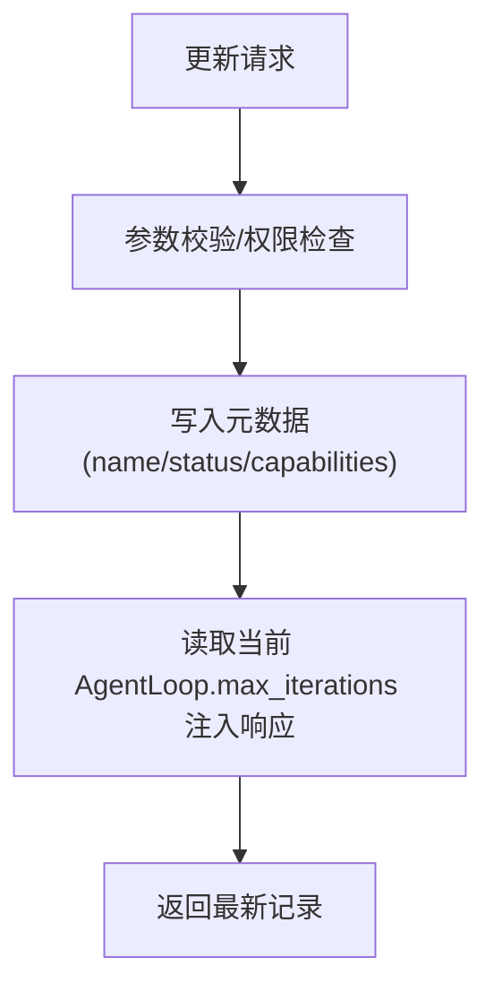
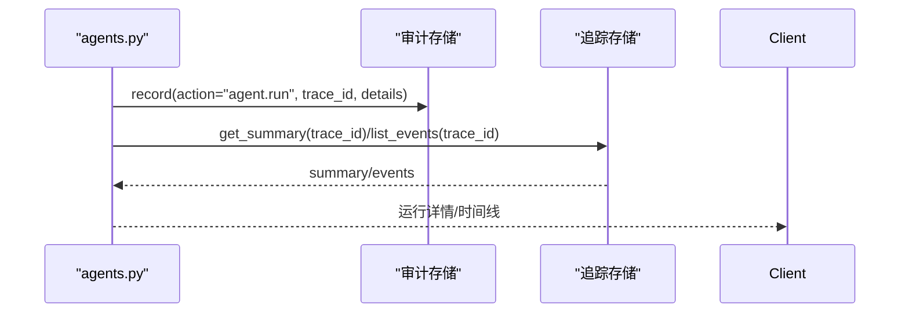
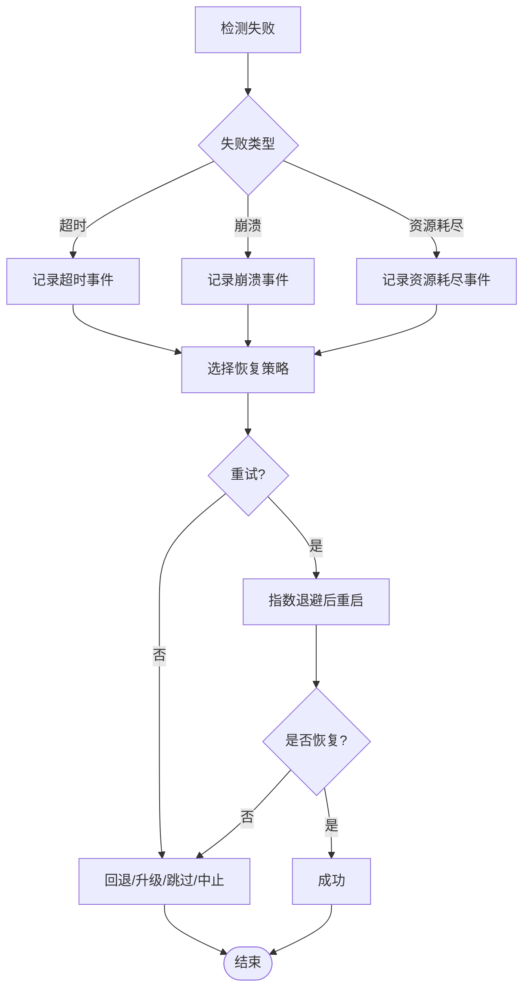
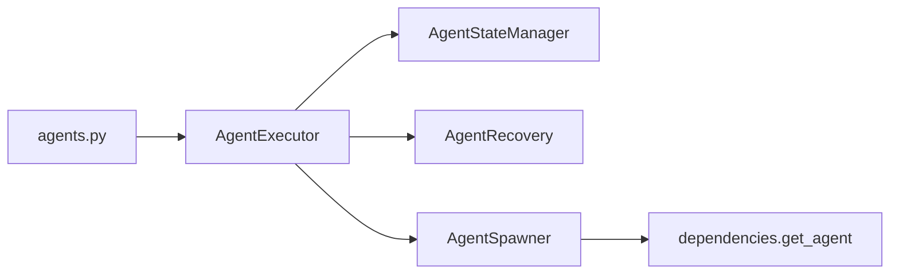

# 智能体管理系统

<cite>
**本文引用的文件**   
- [agent_spawner.py](file://backend/app/core/agent_spawner.py)
- [agent_state_manager.py](file://backend/app/core/agent_state_manager.py)
- [agent_recovery.py](file://backend/app/core/agent_recovery.py)
- [agent_executor.py](file://backend/app/core/agent_v2/agent_executor.py)
- [agents.py](file://backend/app/api/agents.py)
</cite>

## 目录
1. [简介](#简介)
2. [项目结构](#项目结构)
3. [核心组件](#核心组件)
4. [架构总览](#架构总览)
5. [详细组件分析](#详细组件分析)
6. [依赖关系分析](#依赖关系分析)
7. [性能与可扩展性](#性能与可扩展性)
8. [监控与调试](#监控与调试)
9. [配置管理](#配置管理)
10. [故障排查指南](#故障排查指南)
11. [开发指南与最佳实践](#开发指南与最佳实践)
12. [结论](#结论)

## 简介
本文件面向 X-Agent 的智能体管理系统，聚焦以下目标：
- 生命周期管理：创建、启动、暂停、恢复、销毁（终止）的端到端流程
- 状态管理：运行期状态机、快照与恢复、持久化与同步策略
- 配置管理：动态更新与校验、隔离级别与资源限制声明
- 监控与调试：指标收集、日志记录、错误追踪与可观测性
- 开发指南：集成模式、示例路径与最佳实践

## 项目结构
围绕智能体管理的核心代码位于 backend/app/core 与 backend/app/api 下。关键模块职责如下：
- API 层：对外暴露智能体的创建、查询、启停、运行等接口
- 执行编排：AgentExecutor 负责多阶段执行与状态迁移
- 状态管理：AgentStateManager 提供运行上下文与帧对象组装
- 恢复系统：AgentRecovery 负责失败检测与恢复策略
- 调度器：AgentSpawner 负责子智能体实例的创建、隔离、超时控制与统计

图表来源
- [agents.py:30-168](file://backend/app/api/agents.py#L30-L168)
- [agent_executor.py:65-159](file://backend/app/core/agent_v2/agent_executor.py#L65-L159)
- [agent_state_manager.py:19-91](file://backend/app/core/agent_state_manager.py#L19-L91)
- [agent_recovery.py:66-184](file://backend/app/core/agent_recovery.py#L66-L184)
- [agent_spawner.py:134-227](file://backend/app/core/agent_spawner.py#L134-L227)

章节来源
- [agents.py:30-168](file://backend/app/api/agents.py#L30-L168)
- [agent_executor.py:65-159](file://backend/app/core/agent_v2/agent_executor.py#L65-L159)
- [agent_state_manager.py:19-91](file://backend/app/core/agent_state_manager.py#L19-L91)
- [agent_recovery.py:66-184](file://backend/app/core/agent_recovery.py#L66-L184)
- [agent_spawner.py:134-227](file://backend/app/core/agent_spawner.py#L134-L227)

## 核心组件
- AgentSpawner：子智能体实例的生命周期与隔离执行，支持线程级与进程级隔离，提供并发上限、超时控制、清理与统计能力
- AgentExecutor：基于阶段的执行编排，驱动初始化、规划、执行、恢复、完成等阶段的状态迁移与结果聚合
- AgentStateManager：维护 RunContext 与各 Frame（任务、执行、计划、恢复），并提供快照合并与修复更新
- AgentRecovery：失败检测（超时、崩溃、资源耗尽、网络错误）与恢复策略（重试、回退、升级、跳过、中止）
- API agents：REST 接口封装，统一鉴权与审计，暴露运行、暂停、恢复、取消、运行历史与时间线

章节来源
- [agent_spawner.py:134-227](file://backend/app/core/agent_spawner.py#L134-L227)
- [agent_executor.py:28-159](file://backend/app/core/agent_v2/agent_executor.py#L28-L159)
- [agent_state_manager.py:19-91](file://backend/app/core/agent_state_manager.py#L19-L91)
- [agent_recovery.py:66-184](file://backend/app/core/agent_recovery.py#L66-L184)
- [agents.py:30-168](file://backend/app/api/agents.py#L30-L168)

## 架构总览
下图展示从 API 到执行编排、状态管理、恢复系统与调度器的整体交互。

图表来源
- [agents.py:128-168](file://backend/app/api/agents.py#L128-L168)
- [agent_executor.py:65-159](file://backend/app/core/agent_v2/agent_executor.py#L65-L159)
- [agent_state_manager.py:19-91](file://backend/app/core/agent_state_manager.py#L19-L91)
- [agent_recovery.py:143-184](file://backend/app/core/agent_recovery.py#L143-L184)
- [agent_spawner.py:229-306](file://backend/app/core/agent_spawner.py#L229-L306)

## 详细组件分析

### 生命周期管理（创建、启动、暂停、恢复、销毁）
- 创建与启动
  - API 层接收请求，构建 RunContext 并调用 AgentExecutor.run
  - Executor 进入 INITIALIZING，按阶段推进；必要时通过 Spawner 派生子智能体
  - Spawner 在并发上限保护下创建实例，设置隔离级别与超时，启动执行任务
- 暂停与恢复
  - Executor 提供 pause/resume，将状态迁移至 PAUSED 或恢复到暂停前状态
  - 对于长时间运行的子智能体，可通过 terminate_agent 强制终止
- 销毁（终止）
  - Spawner.terminate_agent 会取消异步任务并将状态置为 TERMINATED
  - 清理已完成实例以释放内存

图表来源
- [agent_spawner.py:155-227](file://backend/app/core/agent_spawner.py#L155-L227)
- [agent_spawner.py:386-416](file://backend/app/core/agent_spawner.py#L386-L416)
- [agent_executor.py:189-215](file://backend/app/core/agent_v2/agent_executor.py#L189-L215)
- [agent_recovery.py:143-184](file://backend/app/core/agent_recovery.py#L143-L184)

章节来源
- [agent_spawner.py:155-227](file://backend/app/core/agent_spawner.py#L155-L227)
- [agent_spawner.py:386-416](file://backend/app/core/agent_spawner.py#L386-L416)
- [agent_executor.py:189-215](file://backend/app/core/agent_v2/agent_executor.py#L189-L215)
- [agent_recovery.py:143-184](file://backend/app/core/agent_recovery.py#L143-L184)

### 状态管理机制（持久化、同步、恢复）
- 运行态数据模型
  - AgentRunState 包含 RunContext、TaskFrame、ExecutionFrame、PlanFrame、RecoveryFrame 以及扩展元数据
- 状态装配与快照
  - attach_execution_frame/attach_plan_frame/set_recovery_frame 用于逐步装配
  - apply_state_snapshot 将工作流、审批、浏览器、桌面等子系统状态合并入执行摘要
- 修复更新
  - apply_repair_update 支持工具名、置信度、后续步骤、补救措施、可重试标志等字段更新
- 初始恢复框架
  - build_initial_recovery 提供默认分支、置信度、后续动作与补救说明

图表来源
- [agent_state_manager.py:19-91](file://backend/app/core/agent_state_manager.py#L19-L91)

章节来源
- [agent_state_manager.py:19-91](file://backend/app/core/agent_state_manager.py#L19-L91)

### 配置管理（动态更新与验证）
- 动态更新
  - API 提供 update_agent 接口，允许更新名称、状态、能力集等元信息
  - list/get 接口会注入当前 AgentLoop 的 max_iterations 以便前端展示
- 隔离级别与资源限制
  - Spawner 支持 none/thread/process 三种隔离级别；container 由沙箱路径提供
  - memory_limit_mb/cpu_limit_percent 为声明式元数据，当前不强制 OS 级限制，但会在 spawn 时发出警告
- 并发上限
  - spawn_agent 使用原子锁确保并发计数与实例登记一致，避免超额创建

图表来源
- [agents.py:70-81](file://backend/app/api/agents.py#L70-L81)
- [agents.py:47-67](file://backend/app/api/agents.py#L47-L67)
- [agent_spawner.py:72-100](file://backend/app/core/agent_spawner.py#L72-L100)
- [agent_spawner.py:194-202](file://backend/app/core/agent_spawner.py#L194-L202)
- [agent_spawner.py:179-188](file://backend/app/core/agent_spawner.py#L179-L188)

章节来源
- [agents.py:70-81](file://backend/app/api/agents.py#L70-L81)
- [agents.py:47-67](file://backend/app/api/agents.py#L47-L67)
- [agent_spawner.py:72-100](file://backend/app/core/agent_spawner.py#L72-L100)
- [agent_spawner.py:194-202](file://backend/app/core/agent_spawner.py#L194-L202)
- [agent_spawner.py:179-188](file://backend/app/core/agent_spawner.py#L179-L188)

### 监控与调试（指标、日志、错误追踪）
- 指标与统计
  - Spawner.get_stats 提供总数、活跃数、状态分布与并发上限
  - Recovery.get_recovery_stats 汇总失败次数、监控代理数量与失败类型分布
- 日志与追踪
  - 各模块使用标准 logger 输出关键事件（创建、执行、失败、恢复、终止）
  - API 层记录审计日志（action=agent.run），并返回 trace_id 供链路追踪
- 运行历史与时间线
  - runs 列表与单条运行详情、关联的 trace_summary 与 timeline 事件便于排障

图表来源
- [agents.py:152-168](file://backend/app/api/agents.py#L152-L168)
- [agents.py:189-205](file://backend/app/api/agents.py#L189-L205)
- [agent_spawner.py:560-580](file://backend/app/core/agent_spawner.py#L560-L580)
- [agent_recovery.py:408-427](file://backend/app/core/agent_recovery.py#L408-L427)

章节来源
- [agents.py:152-168](file://backend/app/api/agents.py#L152-L168)
- [agents.py:189-205](file://backend/app/api/agents.py#L189-L205)
- [agent_spawner.py:560-580](file://backend/app/core/agent_spawner.py#L560-L580)
- [agent_recovery.py:408-427](file://backend/app/core/agent_recovery.py#L408-L427)

### 恢复机制（失败检测与策略）
- 失败类型：超时、崩溃、资源耗尽、网络错误、未知
- 恢复策略：重试（指数退避）、回退（切换备用代理）、升级（调用处理函数）、跳过、中止
- 健康检查：根据 agent 属性判断失败并记录 FailureEvent

图表来源
- [agent_recovery.py:86-141](file://backend/app/core/agent_recovery.py#L86-L141)
- [agent_recovery.py:186-230](file://backend/app/core/agent_recovery.py#L186-L230)
- [agent_recovery.py:232-265](file://backend/app/core/agent_recovery.py#L232-L265)
- [agent_recovery.py:267-295](file://backend/app/core/agent_recovery.py#L267-L295)
- [agent_recovery.py:297-342](file://backend/app/core/agent_recovery.py#L297-L342)

章节来源
- [agent_recovery.py:86-141](file://backend/app/core/agent_recovery.py#L86-L141)
- [agent_recovery.py:186-230](file://backend/app/core/agent_recovery.py#L186-L230)
- [agent_recovery.py:232-265](file://backend/app/core/agent_recovery.py#L232-L265)
- [agent_recovery.py:267-295](file://backend/app/core/agent_recovery.py#L267-L295)
- [agent_recovery.py:297-342](file://backend/app/core/agent_recovery.py#L297-L342)

## 依赖关系分析
- API 层依赖依赖注入获取 AgentLoop、审计与追踪存储
- AgentExecutor 依赖 AgentStateManager 进行状态迁移与上下文装配
- AgentSpawner 在需要时通过依赖注入获取 AgentLoop 并执行任务
- AgentRecovery 独立于具体实现，通过通用属性探测失败并执行策略

图表来源
- [agents.py:128-168](file://backend/app/api/agents.py#L128-L168)
- [agent_executor.py:65-159](file://backend/app/core/agent_v2/agent_executor.py#L65-L159)
- [agent_spawner.py:252-273](file://backend/app/core/agent_spawner.py#L252-L273)

章节来源
- [agents.py:128-168](file://backend/app/api/agents.py#L128-L168)
- [agent_executor.py:65-159](file://backend/app/core/agent_v2/agent_executor.py#L65-L159)
- [agent_spawner.py:252-273](file://backend/app/core/agent_spawner.py#L252-L273)

## 性能与可扩展性
- 并发控制
  - Spawner 使用原子锁保证并发上限与实例登记的原子性，避免竞态导致超额创建
- 隔离与健壮性
  - 进程级隔离可防止子智能体崩溃影响父进程；容器级隔离由沙箱路径提供
- 超时与资源
  - 统一的 timeout_seconds 控制执行时长；资源限制为声明式元数据，便于未来接入 OS 级限制
- 清理与统计
  - 定期清理已完成实例，减少内存占用；get_stats 提供运行期概览

章节来源
- [agent_spawner.py:179-188](file://backend/app/core/agent_spawner.py#L179-L188)
- [agent_spawner.py:247-273](file://backend/app/core/agent_spawner.py#L247-L273)
- [agent_spawner.py:530-558](file://backend/app/core/agent_spawner.py#L530-L558)
- [agent_spawner.py:560-580](file://backend/app/core/agent_spawner.py#L560-L580)

## 监控与调试
- 指标采集
  - Spawner 统计：总数、活跃数、状态分布、并发上限
  - Recovery 统计：失败总数、监控代理数、失败类型分布
- 日志记录
  - 关键节点均输出结构化日志（trace_id、状态、错误信息）
- 错误追踪
  - API 层记录审计日志，并通过 trace_id 关联运行详情与时间线事件

章节来源
- [agent_spawner.py:560-580](file://backend/app/core/agent_spawner.py#L560-L580)
- [agent_recovery.py:408-427](file://backend/app/core/agent_recovery.py#L408-L427)
- [agents.py:152-168](file://backend/app/api/agents.py#L152-L168)
- [agents.py:189-205](file://backend/app/api/agents.py#L189-L205)

## 配置管理
- 动态更新
  - 通过 PUT /{agent_id} 更新 name/status/capabilities，并在 GET 中注入 max_iterations
- 隔离级别
  - 支持 none/thread/process；container 需走沙箱路径
- 资源限制
  - memory_limit_mb/cpu_limit_percent 为声明式，spawn 时会记录警告

章节来源
- [agents.py:70-81](file://backend/app/api/agents.py#L70-L81)
- [agents.py:47-67](file://backend/app/api/agents.py#L47-L67)
- [agent_spawner.py:72-100](file://backend/app/core/agent_spawner.py#L72-L100)
- [agent_spawner.py:194-202](file://backend/app/core/agent_spawner.py#L194-L202)

## 故障排查指南
- 常见问题定位
  - 超时：检查 timeout_seconds 与任务复杂度；查看 Spawner 日志中的超时记录
  - 崩溃：确认进程级隔离是否启用；查看 Recovery 的失败类型与重试次数
  - 资源不足：关注 memory_limit_mb/cpu_limit_percent 的声明值与实际使用情况
  - 并发超限：核对 max_concurrent_agents 与活跃实例数
- 快速定位步骤
  - 通过 /runs/{trace_id}/timeline 获取事件序列
  - 结合审计日志与 trace_id 回溯完整链路
  - 使用 Spawner.get_stats 与 Recovery.get_recovery_stats 评估系统健康度

章节来源
- [agent_spawner.py:295-306](file://backend/app/core/agent_spawner.py#L295-L306)
- [agent_recovery.py:86-141](file://backend/app/core/agent_recovery.py#L86-L141)
- [agents.py:189-205](file://backend/app/api/agents.py#L189-L205)
- [agent_spawner.py:560-580](file://backend/app/core/agent_spawner.py#L560-L580)
- [agent_recovery.py:408-427](file://backend/app/core/agent_recovery.py#L408-L427)

## 开发指南与最佳实践
- 集成模式
  - 通过 API 发起运行：POST /api/v1/agents/run，携带 task 与可选 permission_scope
  - 使用 SSE 流式响应：设置 stream=true 获取 event: trace/completed
  - 查询运行详情与时间线：GET /runs/{trace_id} 与 /runs/{trace_id}/timeline
- 状态与恢复
  - 在阶段执行中利用 AgentStateManager 装配执行/计划/恢复帧
  - 对可重试错误采用指数退避重试；不可恢复错误及时中止并上报
- 隔离与资源
  - 高风险任务使用 process 隔离；如需更强隔离请走沙箱路径
  - 合理设置 timeout_seconds 与 max_iterations，避免长尾任务拖垮系统
- 可观测性
  - 始终携带 trace_id；在关键路径记录结构化日志
  - 定期导出 Spawner 与 Recovery 的统计指标，纳入监控大盘

章节来源
- [agents.py:128-168](file://backend/app/api/agents.py#L128-L168)
- [agents.py:189-205](file://backend/app/api/agents.py#L189-L205)
- [agent_state_manager.py:19-91](file://backend/app/core/agent_state_manager.py#L19-L91)
- [agent_recovery.py:186-230](file://backend/app/core/agent_recovery.py#L186-L230)
- [agent_spawner.py:247-273](file://backend/app/core/agent_spawner.py#L247-L273)

## 结论
X-Agent 的智能体管理系统以“编排-状态-恢复-调度”为核心，提供了完整的生命周期管理能力与可观测性支撑。通过清晰的阶段化执行、稳健的恢复策略与灵活的隔离选项，系统在可靠性与可扩展性之间取得良好平衡。建议在生产环境中结合审计与追踪体系，持续优化超时与并发策略，并逐步引入资源限制的强制管控。