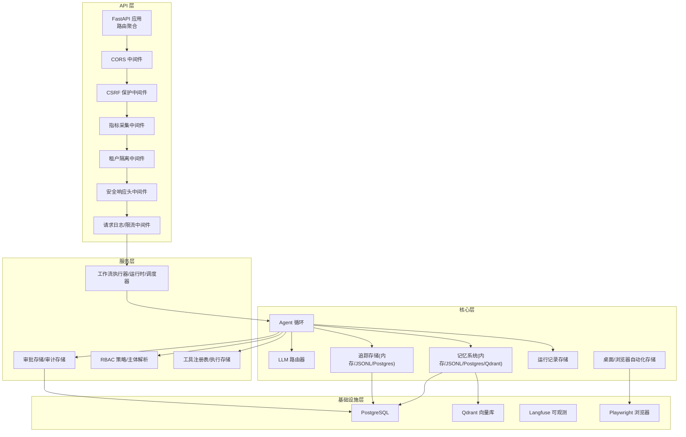
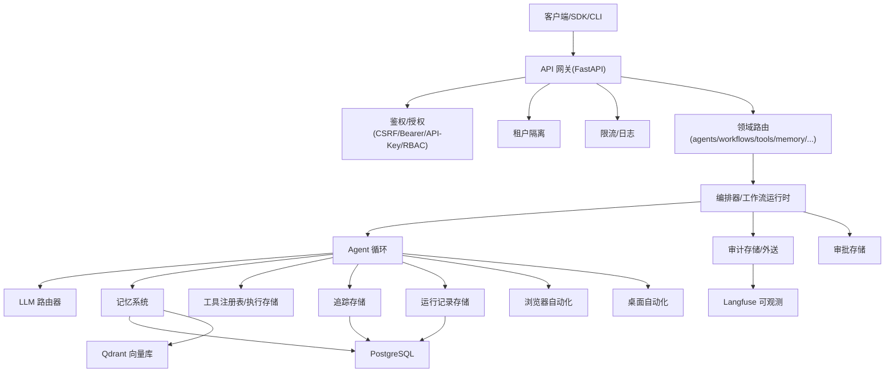
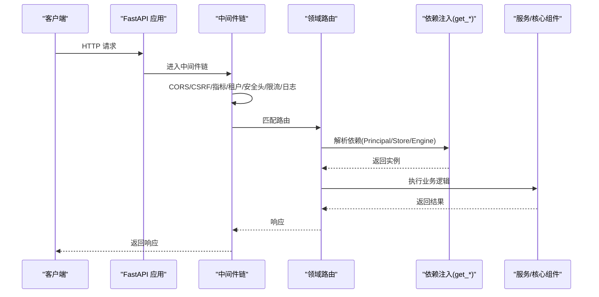
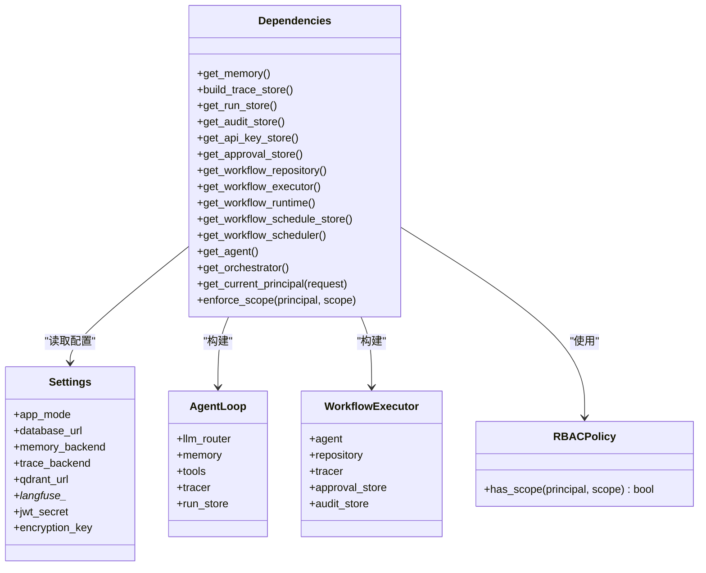
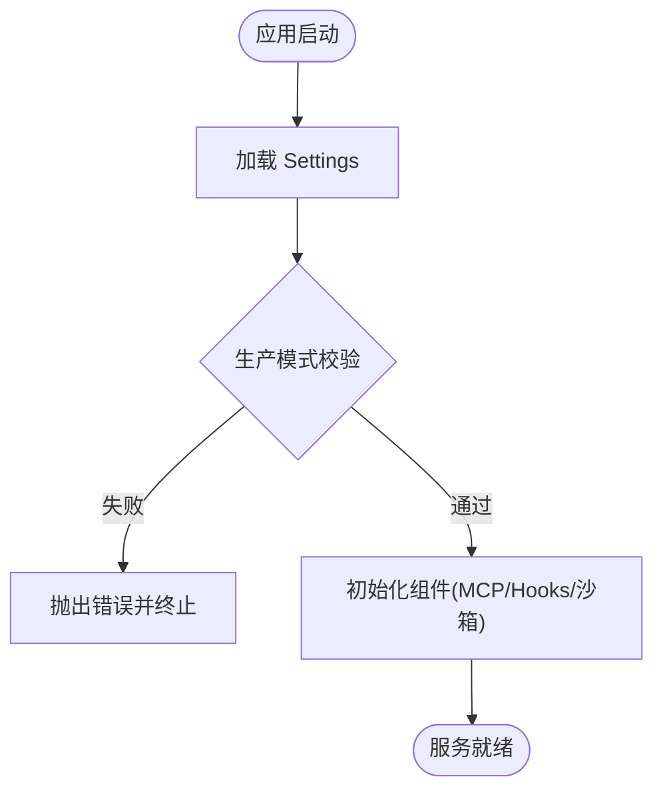
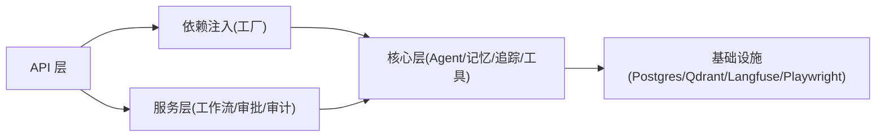

# 架构设计

<cite>
**本文引用的文件**
- [README.md](file://README.md)
- [backend/app/main.py](file://backend/app/main.py)
- [backend/app/web.py](file://backend/app/web.py)
- [backend/app/settings.py](file://backend/app/settings.py)
- [backend/app/dependencies.py](file://backend/app/dependencies.py)
</cite>

## 目录
1. [引言](#引言)
2. [项目结构](#项目结构)
3. [核心组件](#核心组件)
4. [架构总览](#架构总览)
5. [详细组件分析](#详细组件分析)
6. [依赖关系分析](#依赖关系分析)
7. [性能与可扩展性](#性能与可扩展性)
8. [故障排查指南](#故障排查指南)
9. [结论](#结论)
10. [附录](#附录)

## 引言
X-Agent Core 是一个面向企业级场景的开源自主智能体框架，强调安全、可审计、可观测与人机协同。系统采用分层架构：API 层负责对外暴露能力；服务层编排业务逻辑（工作流、审批、策略等）；核心层提供 Agent 循环、记忆、工具注册、LLM 路由、追踪与运行记录；基础设施层对接数据库、向量检索、浏览器自动化与可观测平台。

本架构文档聚焦于分层职责、模块交互、数据流向、关键设计决策（微服务模式、事件驱动、插件化）、系统边界、集成模式与扩展点，并给出架构图与组件分解图，帮助读者快速理解与扩展系统。

## 项目结构
后端以 FastAPI 为入口，通过中间件完成鉴权、限流、租户隔离与安全头注入；启动时初始化 MCP 管理器、Hooks 控制面拦截器、沙箱工作者；按功能域拆分 API Router，统一挂载到应用实例。配置集中管理，支持多后端切换（内存/JSONL/Postgres/Qdrant/Langfuse 等）。

图示来源
- [backend/app/main.py:340-406](file://backend/app/main.py#L340-L406)
- [backend/app/main.py:546-597](file://backend/app/main.py#L546-L597)
- [backend/app/dependencies.py:50-121](file://backend/app/dependencies.py#L50-L121)
- [backend/app/dependencies.py:123-143](file://backend/app/dependencies.py#L123-L143)
- [backend/app/dependencies.py:384-408](file://backend/app/dependencies.py#L384-L408)

章节来源
- [README.md:75-95](file://README.md#L75-L95)
- [backend/app/main.py:340-406](file://backend/app/main.py#L340-L406)
- [backend/app/main.py:546-597](file://backend/app/main.py#L546-L597)

## 核心组件
- 应用装配与生命周期
  - 创建 FastAPI 应用，挂载静态资源与前端页面回退。
  - 注册全局中间件：CORS、CSRF、指标、租户隔离、安全头、请求日志与限流。
  - 启动钩子：初始化 MCP 管理器、加载 Hooks 配置、启动沙箱工作者。
  - 关闭钩子：优雅关闭 MCP 与沙箱工作者。
- 依赖注入与工厂
  - 统一的 get_* 工厂函数，基于 Settings 构建各子系统单例（记忆、追踪、运行记录、工具、工作流、Agent 循环、编排器等）。
  - 支持多后端选择与降级策略（如 Qdrant 不可用时降级至 JSONL/内存）。
- 配置与安全
  - Settings 集中管理环境变量与默认值，生产模式强制校验密钥长度与熵，禁止敏感默认值。
  - 生产模式 fail-fast 检查：拒绝 sqlite/memory/jsonl 作为持久化后端，避免多副本数据分裂。
  - CSRF 豁免策略对 Bearer/API-Key 认证路径放行，同时保留鉴权校验。

章节来源
- [backend/app/main.py:340-406](file://backend/app/main.py#L340-L406)
- [backend/app/main.py:603-700](file://backend/app/main.py#L603-L700)
- [backend/app/dependencies.py:50-121](file://backend/app/dependencies.py#L50-L121)
- [backend/app/dependencies.py:123-143](file://backend/app/dependencies.py#L123-L143)
- [backend/app/dependencies.py:384-408](file://backend/app/dependencies.py#L384-L408)
- [backend/app/settings.py:13-131](file://backend/app/settings.py#L13-L131)
- [backend/app/settings.py:154-199](file://backend/app/settings.py#L154-L199)

## 架构总览
系统遵循“API 层 → 服务层 → 核心层 → 基础设施层”的分层模型，结合以下技术决策：
- 微服务模式：通过独立进程部署 API、Beat（定时任务）、Worker（异步执行），由 Kubernetes/Helm 编排。
- 事件驱动：工作流调度、审计外送、沙箱任务队列等采用事件/队列解耦。
- 插件化：MCP 服务器动态发现与注册、Hooks 控制面拦截、工具注册表扩展。
- 多后端可插拔：记忆/追踪/用户与租户存储均支持多实现与降级。

图示来源
- [backend/app/main.py:340-406](file://backend/app/main.py#L340-L406)
- [backend/app/main.py:546-597](file://backend/app/main.py#L546-L597)
- [backend/app/dependencies.py:50-121](file://backend/app/dependencies.py#L50-L121)
- [backend/app/dependencies.py:123-143](file://backend/app/dependencies.py#L123-L143)
- [backend/app/dependencies.py:384-408](file://backend/app/dependencies.py#L384-L408)
- [backend/app/settings.py:154-199](file://backend/app/settings.py#L154-L199)

## 详细组件分析

### API 层与中间件链
- 职责
  - 统一入口、跨域、CSRF、指标、租户隔离、安全头、限流与请求日志。
  - 健康探针 /health 与就绪探针 /ready，后者检查核心依赖可达性与可选集成状态。
- 关键流程
  - 启动：初始化 MCP 管理器、Hooks、沙箱工作者。
  - 关闭：停止 MCP 与沙箱工作者。
  - 路由：按功能域 include_router 聚合。

图示来源
- [backend/app/main.py:340-406](file://backend/app/main.py#L340-L406)
- [backend/app/main.py:546-597](file://backend/app/main.py#L546-L597)
- [backend/app/main.py:728-800](file://backend/app/main.py#L728-L800)
- [backend/app/dependencies.py:259-306](file://backend/app/dependencies.py#L259-L306)

章节来源
- [backend/app/main.py:340-406](file://backend/app/main.py#L340-L406)
- [backend/app/main.py:546-597](file://backend/app/main.py#L546-L597)
- [backend/app/main.py:603-700](file://backend/app/main.py#L603-L700)
- [backend/app/main.py:728-800](file://backend/app/main.py#L728-L800)

### 依赖注入与工厂
- 职责
  - 集中构建与缓存各子系统实例，屏蔽后端差异与降级策略。
  - 提供 Principal 解析、RBAC 作用域校验、工作流全链路组装、Agent 循环装配。
- 关键点
  - 记忆系统：memory/jsonl/postgres/qdrant 多后端，qdrant 严格模式下不可用则抛错，否则降级。
  - 追踪存储：memory/jsonl/postgres 多后端。
  - 审计存储：生产要求 HMAC 密钥，开发态自动生成临时密钥。
  - 工作流：仓库/执行器/运行时/调度器/计划存储组合装配。
  - Agent：LLM 路由器 + 记忆 + 工具 + 追踪 + 运行记录。

图示来源
- [backend/app/dependencies.py:50-121](file://backend/app/dependencies.py#L50-L121)
- [backend/app/dependencies.py:123-143](file://backend/app/dependencies.py#L123-L143)
- [backend/app/dependencies.py:341-382](file://backend/app/dependencies.py#L341-L382)
- [backend/app/dependencies.py:384-408](file://backend/app/dependencies.py#L384-L408)
- [backend/app/dependencies.py:259-306](file://backend/app/dependencies.py#L259-L306)

章节来源
- [backend/app/dependencies.py:50-121](file://backend/app/dependencies.py#L50-L121)
- [backend/app/dependencies.py:123-143](file://backend/app/dependencies.py#L123-L143)
- [backend/app/dependencies.py:341-382](file://backend/app/dependencies.py#L341-L382)
- [backend/app/dependencies.py:384-408](file://backend/app/dependencies.py#L384-L408)
- [backend/app/dependencies.py:259-306](file://backend/app/dependencies.py#L259-L306)

### 配置与安全策略
- 配置中心
  - Settings 集中定义所有开关与连接参数，支持 .env 与环境变量前缀 XAGENT_。
  - 生产模式强校验：JWT/加密密钥必须非默认且具备足够熵；CORS 禁止通配符。
  - Fail-fast 守卫：生产模式禁止 sqlite/memory/jsonl 作为持久化后端。
- 认证与授权
  - 支持 API Key 与 Bearer Token 两种认证方式；生产模式不允许匿名主体。
  - CSRF 保护针对表单型会话请求，API Key/Bearer 请求豁免但鉴权仍生效。
  - 租户隔离中间件在请求早期校验 tenant_id 一致性，防止越权访问。

图示来源
- [backend/app/settings.py:13-131](file://backend/app/settings.py#L13-L131)
- [backend/app/settings.py:154-199](file://backend/app/settings.py#L154-L199)
- [backend/app/main.py:603-700](file://backend/app/main.py#L603-L700)

章节来源
- [backend/app/settings.py:13-131](file://backend/app/settings.py#L13-L131)
- [backend/app/settings.py:154-199](file://backend/app/settings.py#L154-L199)
- [backend/app/main.py:603-700](file://backend/app/main.py#L603-L700)

### 插件化与扩展点
- MCP 协议集成
  - 启动时初始化 MCP 管理器，动态发现并注册外部工具服务器，失败不阻塞主进程。
- Hooks 控制面拦截
  - 从配置文件声明式加载 Hook，注册到全局 HookManager，在工具执行咽喉点拦截。
- 工具注册表
  - 进程级 ToolCatalog 统一管理工具，支持策略引擎与审批/执行存储联动。
- 工作流与工作项
  - 工作流定义/运行/调度分离，支持异步 Worker 与 Beat 进程扩展。

章节来源
- [backend/app/main.py:603-700](file://backend/app/main.py#L603-L700)
- [backend/app/dependencies.py:384-408](file://backend/app/dependencies.py#L384-L408)

## 依赖关系分析
- 组件耦合
  - API 层仅依赖路由与中间件，通过依赖注入获取服务与核心组件，保持低耦合。
  - 服务层通过工厂函数获取核心组件，避免直接 import 具体实现，便于替换与测试。
  - 核心层对基础设施层通过抽象接口与工厂选择实现，支持多后端与降级。
- 外部依赖
  - PostgreSQL：结构化数据与向量搜索（可选）。
  - Qdrant：向量检索（可选，严格模式不可用则抛错或降级）。
  - Langfuse：可观测性（可选，探针标记 degraded）。
  - Playwright：浏览器自动化（可选）。
- 潜在循环依赖
  - 通过依赖注入与延迟导入规避循环引用；类型标注使用 TYPE_CHECKING 仅在编译期可见。

图示来源
- [backend/app/dependencies.py:50-121](file://backend/app/dependencies.py#L50-L121)
- [backend/app/dependencies.py:123-143](file://backend/app/dependencies.py#L123-L143)
- [backend/app/dependencies.py:384-408](file://backend/app/dependencies.py#L384-L408)

章节来源
- [backend/app/dependencies.py:50-121](file://backend/app/dependencies.py#L50-L121)
- [backend/app/dependencies.py:123-143](file://backend/app/dependencies.py#L123-L143)
- [backend/app/dependencies.py:384-408](file://backend/app/dependencies.py#L384-L408)

## 性能与可扩展性
- 并发与异步
  - FastAPI 基于 ASGI，天然支持高并发；工作流与沙箱任务可异步执行。
- 存储与索引
  - 记忆系统支持向量检索（Postgres 或 Qdrant），可按需开启以提升语义召回效率。
  - 追踪与运行记录可选择 JSONL 或 Postgres，生产建议启用 Postgres 以支撑查询与分析。
- 水平扩展
  - 微服务模式：API/Beat/Worker 独立部署，配合 K8s HPA 自动扩缩容。
  - 无状态 API：会话与令牌外置（如 Redis，当前配置项已预留），利于多副本。
- 降级与弹性
  - Qdrant 不可用时降级至 JSONL/内存；Langfuse 缺失时标记 degraded；审计外送失败不影响写入。

[本节为通用指导，无需特定文件来源]

## 故障排查指南
- 健康与就绪
  - /health 仅检查进程存活；/ready 检查核心组件连通性与可选集成状态。
- 常见配置问题
  - 生产模式未设置必要密钥或使用了默认值：启动即失败。
  - 生产模式使用 sqlite/memory/jsonl：fail-fast 拒绝启动。
  - CORS 包含通配符：生产模式拒绝启动。
- 认证与 CSRF
  - 缺少 API Key 或 Bearer Token：401。
  - 表单请求缺少有效 CSRF Token：403。
  - 租户 ID 不一致：403。
- 可观测与审计
  - 审计 HMAC 密钥未配置：生产模式报错；开发模式生成临时密钥。
  - Langfuse 未接入：/ready 中 observability 标记 degraded。

章节来源
- [backend/app/main.py:728-800](file://backend/app/main.py#L728-L800)
- [backend/app/settings.py:13-131](file://backend/app/settings.py#L13-L131)
- [backend/app/settings.py:154-199](file://backend/app/settings.py#L154-L199)
- [backend/app/dependencies.py:169-196](file://backend/app/dependencies.py#L169-L196)

## 结论
X-Agent Core 的分层架构清晰、职责明确，通过依赖注入与工厂模式实现多后端可插拔与降级，结合微服务、事件驱动与插件化设计，具备良好的可扩展性与运维弹性。生产模式下的强校验与 fail-fast 机制提升了系统的安全性与稳定性。建议在部署时优先启用 Postgres 与 Qdrant，按需接入 Langfuse，并通过 K8s 进行微服务编排与弹性伸缩。

[本节为总结，无需特定文件来源]

## 附录
- 向后兼容
  - web.py 重导出 main.app，保持旧命令可用，推荐统一使用 backend.app.main:app。
- 版本与兼容性
  - 版本号以 pyproject.toml 为单一事实源；Python 3.11+；PostgreSQL 14+；可选 Docker Compose。

章节来源
- [backend/app/web.py:1-22](file://backend/app/web.py#L1-L22)
- [README.md:32-47](file://README.md#L32-L47)
- [README.md:75-95](file://README.md#L75-L95)