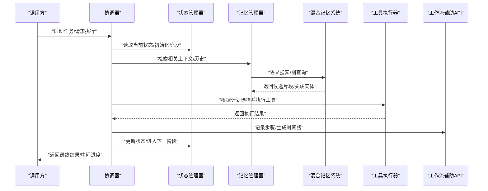
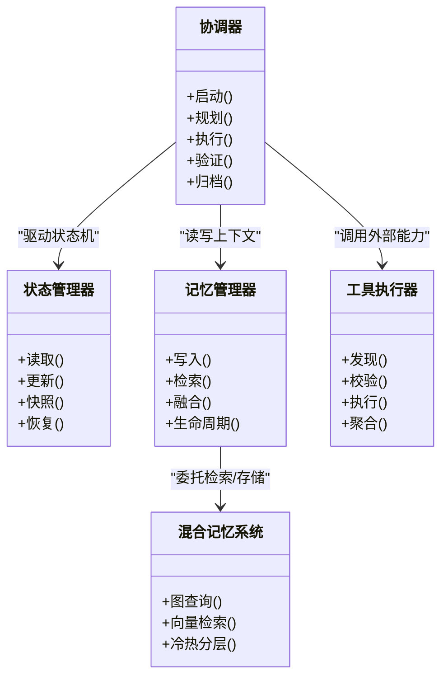
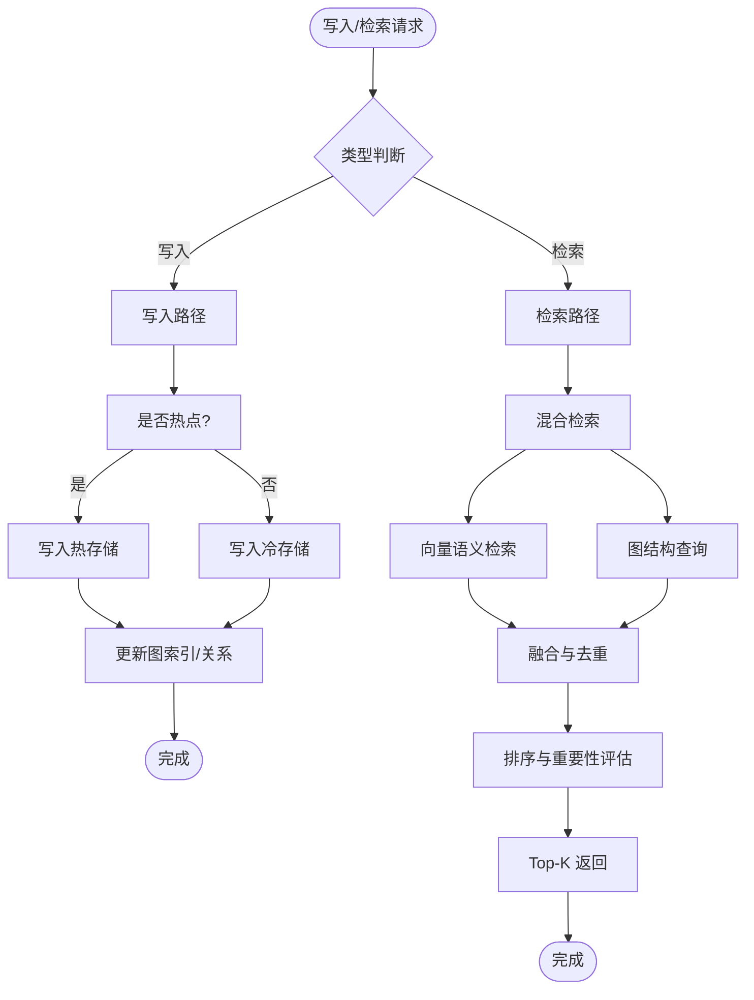
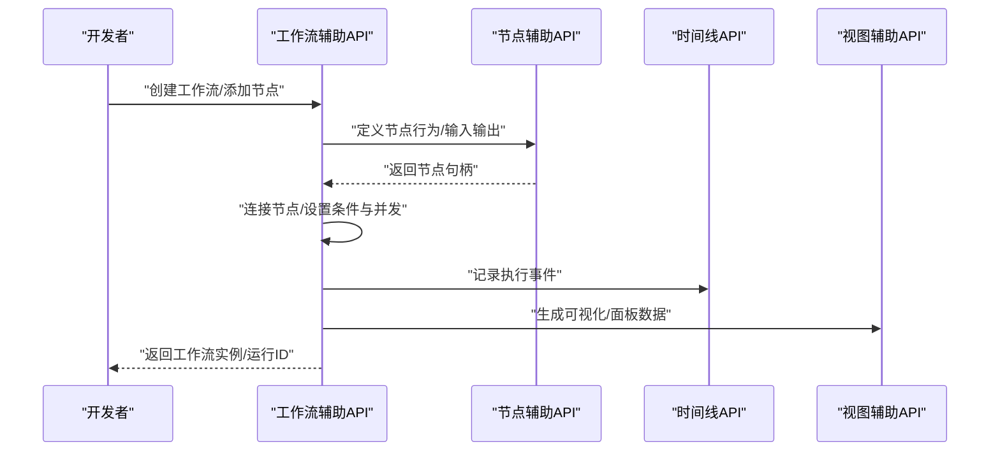
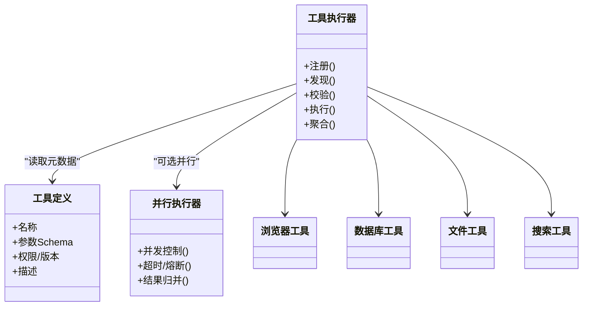
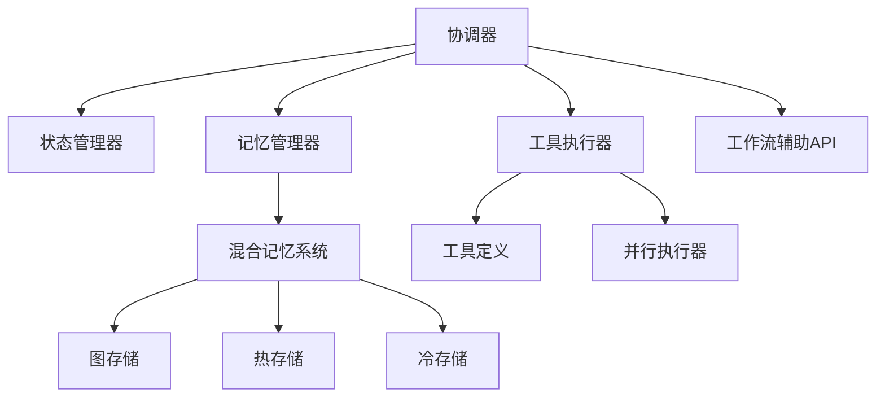

# 核心概念

<cite>
**本文引用的文件**   
- [backend/app/core/agent/coordinator.py](file://backend/app/core/agent/coordinator.py)
- [backend/app/core/agent/state_manager.py](file://backend/app/core/agent/state_manager.py)
- [backend/app/core/agent/memory_manager.py](file://backend/app/core/agent/memory_manager.py)
- [backend/app/core/hybrid_memory_system.py](file://backend/app/core/hybrid_memory_system.py)
- [backend/app/core/graph_memory_store.py](file://backend/app/core/graph_memory_store.py)
- [backend/app/core/hot_memory_store.py](file://backend/app/core/hot_memory_store.py)
- [backend/app/core/cold_memory_store.py](file://backend/app/core/cold_memory_store.py)
- [backend/app/core/memory/lifecycle.py](file://backend/app/core/memory/lifecycle.py)
- [backend/app/core/memory/fusion_system.py](file://backend/app/core/memory/fusion_system.py)
- [backend/app/core/memory/retrieval_optimizer.py](file://backend/app/core/memory/retrieval_optimizer.py)
- [backend/app/core/memory/store.py](file://backend/app/core/memory/store.py)
- [backend/app/api/workflow_helpers.py](file://backend/app/api/workflow_helpers.py)
- [backend/app/api/workflow_node_helpers.py](file://backend/app/api/workflow_node_helpers.py)
- [backend/app/api/workflow_timeline.py](file://backend/app/api/workflow_timeline.py)
- [backend/app/api/workflow_view_helpers.py](file://backend/app/api/workflow_view_helpers.py)
- [backend/app/core/tool_executor.py](file://backend/app/core/tool_executor.py)
- [backend/app/core/tool_definitions.py](file://backend/app/core/tool_definitions.py)
- [backend/app/core/parallel_tool_executor.py](file://backend/app/core/parallel_tool_executor.py)
- [backend/app/core/mcp/tools/browser_tool.py](file://backend/app/core/mcp/tools/browser_tool.py)
- [backend/app/core/mcp/tools/database_tool.py](file://backend/app/core/mcp/tools/database_tool.py)
- [backend/app/core/mcp/tools/file_tool.py](file://backend/app/core/mcp/tools/file_tool.py)
- [backend/app/core/mcp/tools/search_tool.py](file://backend/app/core/mcp/tools/search_tool.py)
- [backend/app/core/agent_collaboration.py](file://backend/app/core/agent_collaboration.py)
- [backend/app/core/agent_communication.py](file://backend/app/core/agent_communication.py)
- [backend/app/core/agent_communication_bus.py](file://backend/app/core/agent_communication_bus.py)
- [backend/app/core/agent_context.py](file://backend/app/core/agent_context.py)
</cite>

## 目录
1. [引言](#引言)
2. [项目结构](#项目结构)
3. [核心组件](#核心组件)
4. [架构总览](#架构总览)
5. [详细组件分析](#详细组件分析)
6. [依赖关系分析](#依赖关系分析)
7. [性能考量](#性能考量)
8. [故障排查指南](#故障排查指南)
9. [结论](#结论)
10. [附录](#附录)

## 引言
本章节面向初学者与高级用户，系统化阐述 X-Agent Core 的核心概念：智能体（Agent）的概念、生命周期与状态管理；记忆系统（图结构记忆、向量嵌入与语义搜索）；工作流编排理念与执行机制；工具系统的注册、发现与执行模式；以及多智能体协作模式（管道、MapReduce、主从、P2P）。文档在提供概念性理解的同时，给出实现层面的关键路径与参考位置，便于深入阅读源码。

## 项目结构
X-Agent Core 围绕“智能体—记忆—工具—工作流—协作”五大能力域组织代码。核心入口与协调逻辑位于 agent 子模块，记忆系统由混合存储与检索优化组成，工具系统通过定义与执行器解耦，工作流以 API 层辅助函数暴露编排能力，多智能体协作通过通信总线与协议抽象实现。

```mermaid
graph TB
subgraph "智能体"
A_coord["协调器<br/>coordinator.py"]
A_state["状态管理<br/>state_manager.py"]
A_mem_mgr["记忆管理器<br/>memory_manager.py"]
A_ctx["上下文<br/>agent_context.py"]
end
subgraph "记忆系统"
HMS["混合记忆系统<br/>hybrid_memory_system.py"]
GStore["图存储<br/>graph_memory_store.py"]
Hot["热存储<br/>hot_memory_store.py"]
Cold["冷存储<br/>cold_memory_store.py"]
MemLife["生命周期<br/>memory/lifecycle.py"]
Fusion["融合系统<br/>memory/fusion_system.py"]
RetOpt["检索优化<br/>memory/retrieval_optimizer.py"]
StoreIF["存储接口<br/>memory/store.py"]
end
subgraph "工具系统"
TDef["工具定义<br/>tool_definitions.py"]
TExec["工具执行器<br/>tool_executor.py"]
PTExec["并行执行器<br/>parallel_tool_executor.py"]
MCP_Browser["浏览器工具<br/>mcp/tools/browser_tool.py"]
MCP_DB["数据库工具<br/>mcp/tools/database_tool.py"]
MCP_File["文件工具<br/>mcp/tools/file_tool.py"]
MCP_Search["搜索工具<br/>mcp/tools/search_tool.py"]
end
subgraph "工作流"
WF_Helpers["工作流辅助API<br/>api/workflow_helpers.py"]
WF_Node["节点辅助API<br/>api/workflow_node_helpers.py"]
WF_Timeline["时间线API<br/>api/workflow_timeline.py"]
WF_View["视图辅助API<br/>api/workflow_view_helpers.py"]
end
subgraph "多智能体协作"
Collab["协作策略<br/>agent_collaboration.py"]
Comm["通信抽象<br/>agent_communication.py"]
Bus["通信总线<br/>agent_communication_bus.py"]
end
A_coord --> A_state
A_coord --> A_mem_mgr
A_mem_mgr --> HMS
HMS --> GStore
HMS --> Hot
HMS --> Cold
HMS --> StoreIF
HMS --> Fusion
HMS --> RetOpt
HMS --> MemLife
A_coord --> TExec
TExec --> TDef
TExec --> PTExec
TExec --> MCP_Browser
TExec --> MCP_DB
TExec --> MCP_File
TExec --> MCP_Search
A_coord --> WF_Helpers
WF_Helpers --> WF_Node
WF_Helpers --> WF_Timeline
WF_Helpers --> WF_View
A_coord --> Collab
Collab --> Comm
Collab --> Bus
```



图表来源
- [backend/app/core/agent/coordinator.py](file://backend/app/core/agent/coordinator.py)
- [backend/app/core/agent/state_manager.py](file://backend/app/core/agent/state_manager.py)
- [backend/app/core/agent/memory_manager.py](file://backend/app/core/agent/memory_manager.py)
- [backend/app/core/hybrid_memory_system.py](file://backend/app/core/hybrid_memory_system.py)
- [backend/app/core/graph_memory_store.py](file://backend/app/core/graph_memory_store.py)
- [backend/app/core/hot_memory_store.py](file://backend/app/core/hot_memory_store.py)
- [backend/app/core/cold_memory_store.py](file://backend/app/core/cold_memory_store.py)
- [backend/app/core/memory/lifecycle.py](file://backend/app/core/memory/lifecycle.py)
- [backend/app/core/memory/fusion_system.py](file://backend/app/core/memory/fusion_system.py)
- [backend/app/core/memory/retrieval_optimizer.py](file://backend/app/core/memory/retrieval_optimizer.py)
- [backend/app/core/memory/store.py](file://backend/app/core/memory/store.py)
- [backend/app/api/workflow_helpers.py](file://backend/app/api/workflow_helpers.py)
- [backend/app/api/workflow_node_helpers.py](file://backend/app/api/workflow_node_helpers.py)
- [backend/app/api/workflow_timeline.py](file://backend/app/api/workflow_timeline.py)
- [backend/app/api/workflow_view_helpers.py](file://backend/app/api/workflow_view_helpers.py)
- [backend/app/core/tool_executor.py](file://backend/app/core/tool_executor.py)
- [backend/app/core/tool_definitions.py](file://backend/app/core/tool_definitions.py)
- [backend/app/core/parallel_tool_executor.py](file://backend/app/core/parallel_tool_executor.py)
- [backend/app/core/mcp/tools/browser_tool.py](file://backend/app/core/mcp/tools/browser_tool.py)
- [backend/app/core/mcp/tools/database_tool.py](file://backend/app/core/mcp/tools/database_tool.py)
- [backend/app/core/mcp/tools/file_tool.py](file://backend/app/core/mcp/tools/file_tool.py)
- [backend/app/core/mcp/tools/search_tool.py](file://backend/app/core/mcp/tools/search_tool.py)
- [backend/app/core/agent_collaboration.py](file://backend/app/core/agent_collaboration.py)
- [backend/app/core/agent_communication.py](file://backend/app/core/agent_communication.py)
- [backend/app/core/agent_communication_bus.py](file://backend/app/core/agent_communication_bus.py)

章节来源
- [backend/app/core/agent/coordinator.py](file://backend/app/core/agent/coordinator.py)
- [backend/app/core/agent/state_manager.py](file://backend/app/core/agent/state_manager.py)
- [backend/app/core/agent/memory_manager.py](file://backend/app/core/agent/memory_manager.py)
- [backend/app/core/hybrid_memory_system.py](file://backend/app/core/hybrid_memory_system.py)
- [backend/app/core/tool_executor.py](file://backend/app/core/tool_executor.py)
- [backend/app/api/workflow_helpers.py](file://backend/app/api/workflow_helpers.py)
- [backend/app/core/agent_collaboration.py](file://backend/app/core/agent_collaboration.py)

## 核心组件
- 智能体协调器：负责调度规划、执行、记忆读写、工具调用与工作流编排，是 Agent 的运行时中枢。
- 状态管理器：维护 Agent 运行期状态机，支持持久化与恢复，确保可观测性与容错。
- 记忆管理器：统一封装记忆写入、检索、融合与生命周期管理，对接混合记忆系统。
- 混合记忆系统：组合图结构记忆、热/冷存储与向量检索，提供语义搜索与知识图谱查询。
- 工具执行器：基于工具定义进行动态发现、参数校验、串行/并行执行与结果聚合。
- 工作流辅助API：提供节点构建、流程组装、时间线与可视化辅助，支撑复杂任务编排。
- 多智能体协作：通过通信抽象与总线，实现管道、MapReduce、主从、P2P等协作模式。

章节来源
- [backend/app/core/agent/coordinator.py](file://backend/app/core/agent/coordinator.py)
- [backend/app/core/agent/state_manager.py](file://backend/app/core/agent/state_manager.py)
- [backend/app/core/agent/memory_manager.py](file://backend/app/core/agent/memory_manager.py)
- [backend/app/core/hybrid_memory_system.py](file://backend/app/core/hybrid_memory_system.py)
- [backend/app/core/tool_executor.py](file://backend/app/core/tool_executor.py)
- [backend/app/api/workflow_helpers.py](file://backend/app/api/workflow_helpers.py)
- [backend/app/core/agent_collaboration.py](file://backend/app/core/agent_collaboration.py)

## 架构总览
下图展示 Agent 在运行时的关键交互：协调器驱动状态机推进，按需访问记忆系统与工具执行器，并通过工作流辅助API完成复杂任务的编排与可视化。



图表来源
- [backend/app/core/agent/coordinator.py](file://backend/app/core/agent/coordinator.py)
- [backend/app/core/agent/state_manager.py](file://backend/app/core/agent/state_manager.py)
- [backend/app/core/agent/memory_manager.py](file://backend/app/core/agent/memory_manager.py)
- [backend/app/core/hybrid_memory_system.py](file://backend/app/core/hybrid_memory_system.py)
- [backend/app/core/tool_executor.py](file://backend/app/core/tool_executor.py)
- [backend/app/api/workflow_helpers.py](file://backend/app/api/workflow_helpers.py)

## 详细组件分析

### 智能体（Agent）概念、生命周期与状态管理
- 概念：Agent 是以目标为导向的自主执行单元，具备感知（记忆检索）、决策（规划/编排）、行动（工具执行）与反思（状态更新/学习）的能力闭环。
- 生命周期：通常包含初始化、规划、执行、验证/修复、完成/归档等阶段，各阶段由状态机驱动并可持久化恢复。
- 状态管理：状态管理器维护阶段、上下文、里程碑与错误信息，支持快照与回滚，保障长时运行的稳定性。



图表来源
- [backend/app/core/agent/coordinator.py](file://backend/app/core/agent/coordinator.py)
- [backend/app/core/agent/state_manager.py](file://backend/app/core/agent/state_manager.py)
- [backend/app/core/agent/memory_manager.py](file://backend/app/core/agent/memory_manager.py)
- [backend/app/core/hybrid_memory_system.py](file://backend/app/core/hybrid_memory_system.py)
- [backend/app/core/tool_executor.py](file://backend/app/core/tool_executor.py)

章节来源
- [backend/app/core/agent/coordinator.py](file://backend/app/core/agent/coordinator.py)
- [backend/app/core/agent/state_manager.py](file://backend/app/core/agent/state_manager.py)
- [backend/app/core/agent/memory_manager.py](file://backend/app/core/agent/memory_manager.py)

### 记忆系统：图结构记忆、向量嵌入与语义搜索
- 设计要点：
  - 图结构记忆：以实体与关系建模领域知识，支持路径推理与关联扩展。
  - 向量嵌入与语义搜索：将文本/结构化片段向量化，支持相似度检索与跨模态对齐。
  - 冷热分层：热存储用于高频访问，冷存储用于长期归档，兼顾延迟与成本。
  - 融合与优化：多路召回融合、去重与重要性评分，提升检索质量与效率。
- 关键模块：
  - 混合记忆系统：统一入口，协调图、向量与分层存储。
  - 图存储/热存储/冷存储：分别承担不同职责。
  - 生命周期：控制记忆的创建、晋升、降级与清理。
  - 融合系统：合并多源结果，消除冗余。
  - 检索优化：排序、过滤与缓存策略。



图表来源
- [backend/app/core/hybrid_memory_system.py](file://backend/app/core/hybrid_memory_system.py)
- [backend/app/core/graph_memory_store.py](file://backend/app/core/graph_memory_store.py)
- [backend/app/core/hot_memory_store.py](file://backend/app/core/hot_memory_store.py)
- [backend/app/core/cold_memory_store.py](file://backend/app/core/cold_memory_store.py)
- [backend/app/core/memory/lifecycle.py](file://backend/app/core/memory/lifecycle.py)
- [backend/app/core/memory/fusion_system.py](file://backend/app/core/memory/fusion_system.py)
- [backend/app/core/memory/retrieval_optimizer.py](file://backend/app/core/memory/retrieval_optimizer.py)
- [backend/app/core/memory/store.py](file://backend/app/core/memory/store.py)

章节来源
- [backend/app/core/hybrid_memory_system.py](file://backend/app/core/hybrid_memory_system.py)
- [backend/app/core/graph_memory_store.py](file://backend/app/core/graph_memory_store.py)
- [backend/app/core/hot_memory_store.py](file://backend/app/core/hot_memory_store.py)
- [backend/app/core/cold_memory_store.py](file://backend/app/core/cold_memory_store.py)
- [backend/app/core/memory/lifecycle.py](file://backend/app/core/memory/lifecycle.py)
- [backend/app/core/memory/fusion_system.py](file://backend/app/core/memory/fusion_system.py)
- [backend/app/core/memory/retrieval_optimizer.py](file://backend/app/core/memory/retrieval_optimizer.py)
- [backend/app/core/memory/store.py](file://backend/app/core/memory/store.py)

### 工作流编排：设计理念与执行机制
- 设计理念：以“节点+边”的有向图描述任务，支持条件分支、循环、并发与补偿；通过辅助API快速构建、调试与可视化。
- 执行机制：协调器或工作流引擎解析图结构，按拓扑顺序调度节点，收集中间产物，处理异常与重试，输出时间线与审计日志。
- 辅助API：提供节点构造、连接、时间线查询与视图渲染辅助，降低编排复杂度。



图表来源
- [backend/app/api/workflow_helpers.py](file://backend/app/api/workflow_helpers.py)
- [backend/app/api/workflow_node_helpers.py](file://backend/app/api/workflow_node_helpers.py)
- [backend/app/api/workflow_timeline.py](file://backend/app/api/workflow_timeline.py)
- [backend/app/api/workflow_view_helpers.py](file://backend/app/api/workflow_view_helpers.py)

章节来源
- [backend/app/api/workflow_helpers.py](file://backend/app/api/workflow_helpers.py)
- [backend/app/api/workflow_node_helpers.py](file://backend/app/api/workflow_node_helpers.py)
- [backend/app/api/workflow_timeline.py](file://backend/app/api/workflow_timeline.py)
- [backend/app/api/workflow_view_helpers.py](file://backend/app/api/workflow_view_helpers.py)

### 工具系统：注册、发现与执行模式
- 注册与发现：通过工具定义集中声明能力元数据（名称、参数、权限、版本），执行器在运行时动态加载与发现。
- 执行模式：支持串行与并行执行，内置批处理与超时控制，对失败进行隔离与重试。
- 典型工具：浏览器自动化、数据库操作、文件系统、通用搜索等，均遵循统一接口。



图表来源
- [backend/app/core/tool_definitions.py](file://backend/app/core/tool_definitions.py)
- [backend/app/core/tool_executor.py](file://backend/app/core/tool_executor.py)
- [backend/app/core/parallel_tool_executor.py](file://backend/app/core/parallel_tool_executor.py)
- [backend/app/core/mcp/tools/browser_tool.py](file://backend/app/core/mcp/tools/browser_tool.py)
- [backend/app/core/mcp/tools/database_tool.py](file://backend/app/core/mcp/tools/database_tool.py)
- [backend/app/core/mcp/tools/file_tool.py](file://backend/app/core/mcp/tools/file_tool.py)
- [backend/app/core/mcp/tools/search_tool.py](file://backend/app/core/mcp/tools/search_tool.py)

章节来源
- [backend/app/core/tool_definitions.py](file://backend/app/core/tool_definitions.py)
- [backend/app/core/tool_executor.py](file://backend/app/core/tool_executor.py)
- [backend/app/core/parallel_tool_executor.py](file://backend/app/core/parallel_tool_executor.py)
- [backend/app/core/mcp/tools/browser_tool.py](file://backend/app/core/mcp/tools/browser_tool.py)
- [backend/app/core/mcp/tools/database_tool.py](file://backend/app/core/mcp/tools/database_tool.py)
- [backend/app/core/mcp/tools/file_tool.py](file://backend/app/core/mcp/tools/file_tool.py)
- [backend/app/core/mcp/tools/search_tool.py](file://backend/app/core/mcp/tools/search_tool.py)

### 多智能体协作：管道、MapReduce、主从、P2P
- 管道模式：多个 Agent 依次处理数据，前一个的输出作为下一个的输入，适合流水线式任务。
- MapReduce 模式：主 Agent 分发子任务给多个 Worker Agent，汇总结果后进行二次处理。
- 主从模式：主 Agent 负责规划与协调，从 Agent 专注执行特定子任务，便于资源隔离与权限控制。
- P2P 模式：Agent 之间点对点通信，灵活协商角色与任务分配，适用于去中心化场景。

```mermaid
graph LR
A["Agent A"] --> B["Agent B"]
B --> C["Agent C"]
subgraph "管道模式"
A --- B --- C
end
M["Master Agent"] --> W1["Worker 1"]
M --> W2["Worker 2"]
M --> W3["Worker 3"]
W1 --> M
W2 --> M
W3 --> M
subgraph "MapReduce/主从"
M --- W1 --- W2 --- W3
end
X["Agent X"] < --> Y["Agent Y"]
Y < --> Z["Agent Z"]
subgraph "P2P"
X --- Y --- Z
end
```

图表来源
- [backend/app/core/agent_collaboration.py](file://backend/app/core/agent_collaboration.py)
- [backend/app/core/agent_communication.py](file://backend/app/core/agent_communication.py)
- [backend/app/core/agent_communication_bus.py](file://backend/app/core/agent_communication_bus.py)

章节来源
- [backend/app/core/agent_collaboration.py](file://backend/app/core/agent_collaboration.py)
- [backend/app/core/agent_communication.py](file://backend/app/core/agent_communication.py)
- [backend/app/core/agent_communication_bus.py](file://backend/app/core/agent_communication_bus.py)

### 使用场景与示例指引
- 端到端任务编排：通过工作流辅助API构建多节点流程，结合工具执行器调用浏览器/数据库/文件/搜索等能力，利用记忆系统进行上下文检索与沉淀。
- 批量数据处理：采用 MapReduce 模式，主 Agent 拆分任务，多个 Worker 并行执行，最后聚合结果并写入记忆系统。
- 实时交互助手：管道模式下，前端请求经协调器路由至对话 Agent，再调用搜索与文件工具获取信息，最终返回结果并更新会话记忆。
- 参考路径（不含具体代码内容）：
  - 工作流构建与时间线查看：[backend/app/api/workflow_helpers.py](file://backend/app/api/workflow_helpers.py)、[backend/app/api/workflow_timeline.py](file://backend/app/api/workflow_timeline.py)
  - 工具调用与并行执行：[backend/app/core/tool_executor.py](file://backend/app/core/tool_executor.py)、[backend/app/core/parallel_tool_executor.py](file://backend/app/core/parallel_tool_executor.py)
  - 记忆检索与融合：[backend/app/core/hybrid_memory_system.py](file://backend/app/core/hybrid_memory_system.py)、[backend/app/core/memory/fusion_system.py](file://backend/app/core/memory/fusion_system.py)

## 依赖关系分析
- 松耦合设计：协调器通过接口与抽象依赖记忆、工具与工作流模块，避免紧耦合。
- 内聚性：记忆系统内部按职责划分（图、向量、冷热、融合、优化），工具系统按定义与执行分离。
- 潜在环依赖：应确保协调器不直接依赖底层存储实现，而是通过记忆管理器与混合记忆系统间接访问。
- 外部集成点：MCP 工具集作为外部能力接入点，需关注版本兼容与权限边界。



图表来源
- [backend/app/core/agent/coordinator.py](file://backend/app/core/agent/coordinator.py)
- [backend/app/core/agent/state_manager.py](file://backend/app/core/agent/state_manager.py)
- [backend/app/core/agent/memory_manager.py](file://backend/app/core/agent/memory_manager.py)
- [backend/app/core/hybrid_memory_system.py](file://backend/app/core/hybrid_memory_system.py)
- [backend/app/core/tool_executor.py](file://backend/app/core/tool_executor.py)
- [backend/app/core/tool_definitions.py](file://backend/app/core/tool_definitions.py)
- [backend/app/core/parallel_tool_executor.py](file://backend/app/core/parallel_tool_executor.py)
- [backend/app/core/graph_memory_store.py](file://backend/app/core/graph_memory_store.py)
- [backend/app/core/hot_memory_store.py](file://backend/app/core/hot_memory_store.py)
- [backend/app/core/cold_memory_store.py](file://backend/app/core/cold_memory_store.py)

章节来源
- [backend/app/core/agent/coordinator.py](file://backend/app/core/agent/coordinator.py)
- [backend/app/core/agent/state_manager.py](file://backend/app/core/agent/state_manager.py)
- [backend/app/core/agent/memory_manager.py](file://backend/app/core/agent/memory_manager.py)
- [backend/app/core/hybrid_memory_system.py](file://backend/app/core/hybrid_memory_system.py)
- [backend/app/core/tool_executor.py](file://backend/app/core/tool_executor.py)
- [backend/app/core/tool_definitions.py](file://backend/app/core/tool_definitions.py)
- [backend/app/core/parallel_tool_executor.py](file://backend/app/core/parallel_tool_executor.py)
- [backend/app/core/graph_memory_store.py](file://backend/app/core/graph_memory_store.py)
- [backend/app/core/hot_memory_store.py](file://backend/app/core/hot_memory_store.py)
- [backend/app/core/cold_memory_store.py](file://backend/app/core/cold_memory_store.py)

## 性能考量
- 记忆检索：优先使用热存储与缓存，减少冷存储访问；融合与去重降低重复计算；向量检索可引入近似最近邻与分片策略。
- 工具执行：合理设置并发度与超时，避免资源争用；对慢工具进行限流与熔断；批处理合并小任务以降低开销。
- 工作流执行：拓扑排序与并行调度最大化吞吐；中间产物尽量落盘，避免内存膨胀；失败重试与补偿保证幂等。
- 状态管理：增量快照与差异存储，缩短恢复时间；关键路径加埋点与指标上报，便于定位瓶颈。

## 故障排查指南
- 状态不一致：检查状态管理器快照与恢复逻辑，确认阶段转换是否正确；核对协调器的状态更新时机。
- 记忆检索低效：观察融合与排序策略，调整阈值与权重；检查冷热分层是否生效；验证图索引一致性。
- 工具执行失败：查看工具定义与权限配置；确认并行执行器的超时与熔断策略；检查 MCP 工具连通性。
- 工作流卡死：审查节点依赖与条件分支；查看时间线事件定位阻塞点；必要时启用断点与回放。

章节来源
- [backend/app/core/agent/state_manager.py](file://backend/app/core/agent/state_manager.py)
- [backend/app/core/memory/fusion_system.py](file://backend/app/core/memory/fusion_system.py)
- [backend/app/core/tool_executor.py](file://backend/app/core/tool_executor.py)
- [backend/app/api/workflow_timeline.py](file://backend/app/api/workflow_timeline.py)

## 结论
X-Agent Core 以协调器为核心，串联状态管理、记忆系统、工具执行与工作流编排，形成高内聚、低耦合的智能体运行时。记忆系统通过图结构与向量检索的结合，提供强大的语义理解与知识推理能力；工具系统以定义与执行分离的方式实现可扩展的外部能力接入；工作流与多智能体协作为复杂业务提供了灵活的编排与协作范式。建议在工程实践中结合监控与可观测性手段，持续优化性能与可靠性。

## 附录
- 术语表：
  - 智能体（Agent）：具备感知、决策、行动与反思能力的自主执行单元。
  - 记忆系统：包括图结构记忆、向量嵌入与冷热分层存储的综合体系。
  - 工作流：以节点和边描述的有向图，表达任务执行流程。
  - 工具：对外部能力的标准化封装，具备统一的元数据与执行接口。
  - 多智能体协作：多个 Agent 通过通信抽象与总线协同完成任务的模式集合。