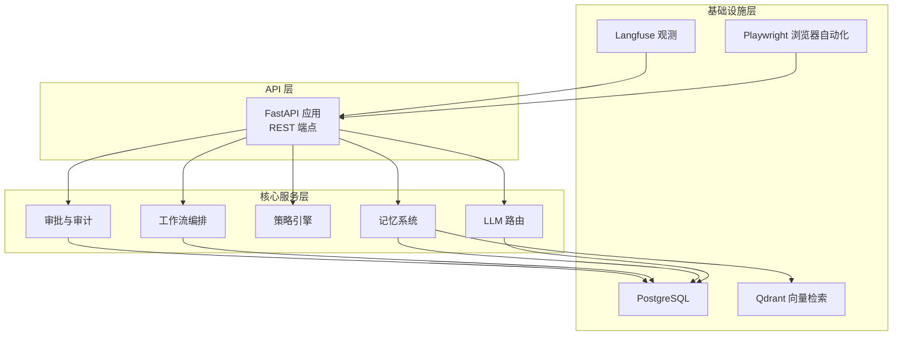
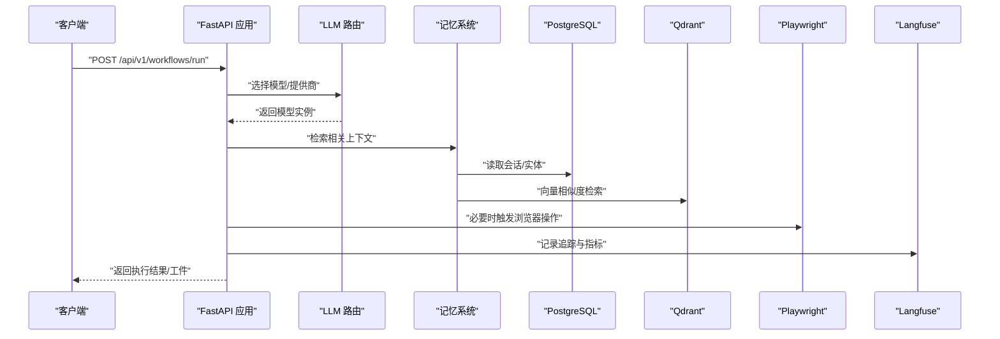
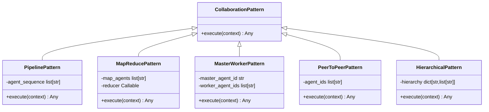
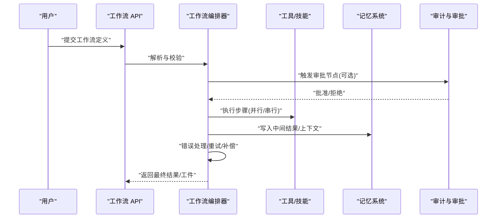
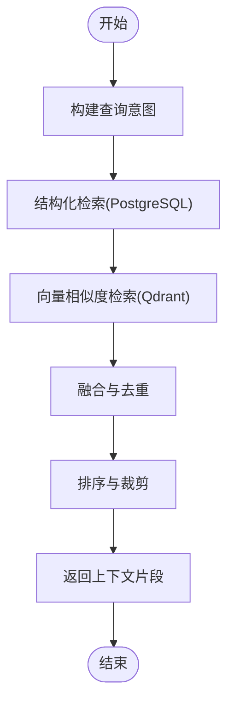
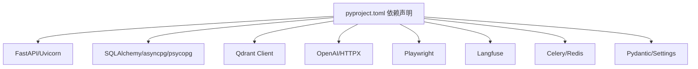

# 项目概述

<cite>
**本文引用的文件**   
- [README.md](file://README.md)
- [pyproject.toml](file://pyproject.toml)
- [docs/README.md](file://docs/README.md)
- [commercial_audit/00_商用交付差距审计报告.md](file://commercial_audit/00_商用交付差距审计报告.md)
- [archive/dead_code_2026-07-19/backend/app/core/collaboration/patterns.py](file://archive/dead_code_2026-07-19/backend/app/core/collaboration/patterns.py)
</cite>

## 目录
1. [引言](#引言)
2. [项目结构](#项目结构)
3. [核心组件](#核心组件)
4. [架构总览](#架构总览)
5. [详细组件分析](#详细组件分析)
6. [依赖分析](#依赖分析)
7. [性能考量](#性能考量)
8. [故障排查指南](#故障排查指南)
9. [结论](#结论)
10. [附录](#附录)

## 引言
X-Agent Core 是一个面向企业级场景的开源自主智能体框架，强调“可自托管、可审计、可监督”的核心价值主张。其技术理念围绕多 LLM 路由、高级记忆系统、工作流编排与人类审批闭环展开，目标应用场景包括：复杂任务自动化、跨系统协作、安全敏感流程治理、以及需要强审计与合规的企业环境。

当前版本状态为 0.2.0-alpha，处于“商用修复中”的阶段（Phase 1「止血与架构收敛」），商用就绪度综合评分约 31/100，尚不具备对外商用交付条件。该评估来源于仓库内商业审计报告的集成结论，详见文末引用。

## 项目结构
仓库采用模块化分层组织，后端以 FastAPI 提供 API 层，核心服务层包含 LLM 路由、记忆系统、策略引擎、工作流与审批等；基础设施层对接 PostgreSQL、Qdrant、Playwright、Langfuse 等外部能力。文档按四分册组织（概念、运维、管理员、开发者），便于不同角色快速定位。

图示来源
- [README.md:75-95](file://README.md#L75-L95)

章节来源
- [README.md:1-163](file://README.md#L1-L163)
- [docs/README.md:1-60](file://docs/README.md#L1-L60)

## 核心组件
- 多 LLM 路由：支持在不同模型提供商间切换，生产路径目前为顺序 fallback，未来计划收敛至统一智能路由并扩展更多厂商。
- 高级记忆系统：基于图与向量的混合记忆，具备语义检索与上下文恢复能力；当前实现存在多处并存与未接线问题，需收敛与真实接入。
- 工作流编排：定义、调度与执行多步骤工作流，具备重试、补偿与审批节点；存储与运行态需迁移至持久化与外置执行器。
- 多智能体协作：提供流水线、主从、对等、层次等多种协作模式；当前多为骨架代码，需与运行时打通。
- 浏览器自动化：集成 Playwright 进行网页交互与数据提取；当前主 API 存在假成功路径，需修复为真实异步实现。
- 观测与追踪：通过 Langfuse 进行全链路请求追踪与性能监控；需补齐指标挂载与告警规则。
- 审批与审计：内置人类在环审批与审计日志链；需完善租户隔离、身份可信与留存外送。
- 插件与技能：可扩展插件体系与技能市场；当前路由未注册或零调用方，需选择一套实现并接线或删除冗余。
- MCP 协议：计划支持 Model Context Protocol 工具发现与管理；当前为私有协议，需改用官方 SDK。

章节来源
- [README.md:14-31](file://README.md#L14-L31)
- [commercial_audit/00_商用交付差距审计报告.md:164-186](file://commercial_audit/00_商用交付差距审计报告.md#L164-L186)

## 架构总览
整体遵循“API 层 → 核心服务层 → 基础设施层”的分层设计，强调模块解耦与可替换性。关键交互如下：
- API 层暴露 /workflows、/agents、/tools、/memory、/approvals 等端点。
- 核心服务层协调 LLM 路由、记忆系统、策略引擎与工作流执行。
- 基础设施层提供数据库、向量检索、浏览器自动化与观测能力。

图示来源
- [README.md:75-95](file://README.md#L75-L95)

## 详细组件分析

### 多智能体协作模式（类关系）
协作模式定义了多种多智能体协同拓扑，包括流水线、MapReduce、主从、对等与层次结构。这些模式抽象了任务分解、并行执行与结果聚合的流程。

图示来源
- [archive/dead_code_2026-07-19/backend/app/core/collaboration/patterns.py:25-38](file://archive/dead_code_2026-07-19/backend/app/core/collaboration/patterns.py#L25-L38)
- [archive/dead_code_2026-07-19/backend/app/core/collaboration/patterns.py:41-75](file://archive/dead_code_2026-07-19/backend/app/core/collaboration/patterns.py#L41-L75)
- [archive/dead_code_2026-07-19/backend/app/core/collaboration/patterns.py:78-130](file://archive/dead_code_2026-07-19/backend/app/core/collaboration/patterns.py#L78-L130)
- [archive/dead_code_2026-07-19/backend/app/core/collaboration/patterns.py:169-208](file://archive/dead_code_2026-07-19/backend/app/core/collaboration/patterns.py#L169-L208)
- [archive/dead_code_2026-07-19/backend/app/core/collaboration/patterns.py:211-260](file://archive/dead_code_2026-07-19/backend/app/core/collaboration/patterns.py#L211-L260)
- [archive/dead_code_2026-07-19/backend/app/core/collaboration/patterns.py:263-327](file://archive/dead_code_2026-07-19/backend/app/core/collaboration/patterns.py#L263-L327)

章节来源
- [archive/dead_code_2026-07-19/backend/app/core/collaboration/patterns.py:1-327](file://archive/dead_code_2026-07-19/backend/app/core/collaboration/patterns.py#L1-L327)

### 工作流执行流程（序列图）
工作流编排负责将复杂任务拆解为多个步骤，并在每个步骤中调用工具、记忆与 LLM 能力，同时支持重试、补偿与审批节点。

图示来源
- [README.md:14-31](file://README.md#L14-L31)

章节来源
- [README.md:14-31](file://README.md#L14-L31)

### 记忆检索流程（流程图）
记忆系统结合结构化存储与向量检索，提供上下文召回与去重合并的能力。

图示来源
- [README.md:14-31](file://README.md#L14-L31)

章节来源
- [README.md:14-31](file://README.md#L14-L31)

## 依赖分析
项目的 Python 依赖集中在后端核心能力上，包括 Web 框架、数据库驱动、向量检索、浏览器自动化、观测与消息队列等。开发、生产与测试依赖分离，便于按需安装与最小化部署。

图示来源
- [pyproject.toml:11-30](file://pyproject.toml#L11-L30)

章节来源
- [pyproject.toml:1-169](file://pyproject.toml#L1-L169)

## 性能考量
- 并发与并行：工作流与工具执行应充分利用 asyncio.gather 进行并行化，避免阻塞事件循环。
- 缓存与索引：对高频检索的记忆片段建立缓存层，数据库与向量库均需合理索引。
- 资源限制：沙箱执行需设置 CPU/内存上限与网络白名单，防止资源滥用。
- 观测与基线：通过 Langfuse 与 Prometheus 收集关键指标，建立性能基线与告警阈值。

[本节为通用指导，不直接分析具体文件]

## 故障排查指南
- 启动失败：检查环境变量前缀是否一致、数据库 schema 是否初始化、worker 命令是否正确。
- 监控空转：确认 /metrics 端点已挂载、Prometheus 配置收敛、告警表达式与实际指标匹配。
- 认证与安全：确保 OIDC/SAML 签名验证开启、租户隔离中间件生效、审计日志不可跨租户访问。
- 前端路由：核对前后端路由契约，修复漂移端点与登录 UI。
- 浏览器自动化：避免同步与异步冲突，确保真实异步实现被调用而非 fallback。

章节来源
- [commercial_audit/00_商用交付差距审计报告.md:199-210](file://commercial_audit/00_商用交付差距审计报告.md#L199-L210)
- [commercial_audit/00_商用交付差距审计报告.md:210-221](file://commercial_audit/00_商用交付差距审计报告.md#L210-L221)
- [commercial_audit/00_商用交付差距审计报告.md:222-233](file://commercial_audit/00_商用交付差距审计报告.md#L222-L233)

## 结论
X-Agent Core 在企业级自主智能体领域具备明确的价值主张与技术方向，但当前仍处于“止血与架构收敛”阶段。建议优先完成 Phase 1 的关键修复与死代码删除，统一版本叙事与质量证据链，随后进入 Phase 2 补齐企业级能力（SSO/SCIM、审计留存、MCP 官方 SDK、Workflow 持久化等）。差异化竞争应聚焦“完全自托管 + 证据驱动 + 记忆/多模型透明”，逐步构建商业化管道与生态。

[本节为总结性内容，不直接分析具体文件]

## 附录
- 版本信息：单一事实源位于 pyproject.toml，当前版本为 0.2.0-alpha。
- 文档索引：四分册结构便于不同角色快速定位，详见 docs/README.md。
- 商用交付评估：综合评分约 31/100，详见 commercial_audit/00_商用交付差距审计报告.md。

章节来源
- [pyproject.toml:5-10](file://pyproject.toml#L5-L10)
- [docs/README.md:1-60](file://docs/README.md#L1-L60)
- [commercial_audit/00_商用交付差距审计报告.md:10-28](file://commercial_audit/00_商用交付差距审计报告.md#L10-L28)